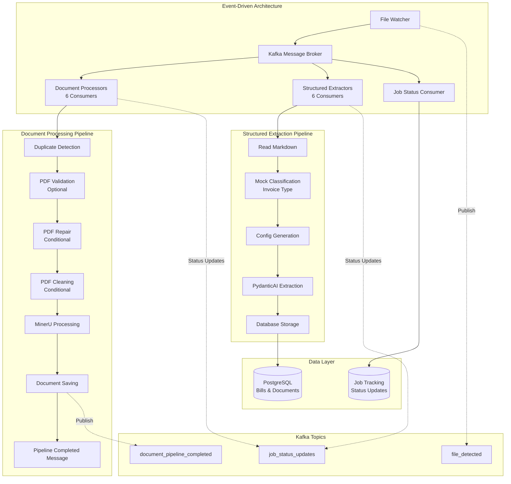
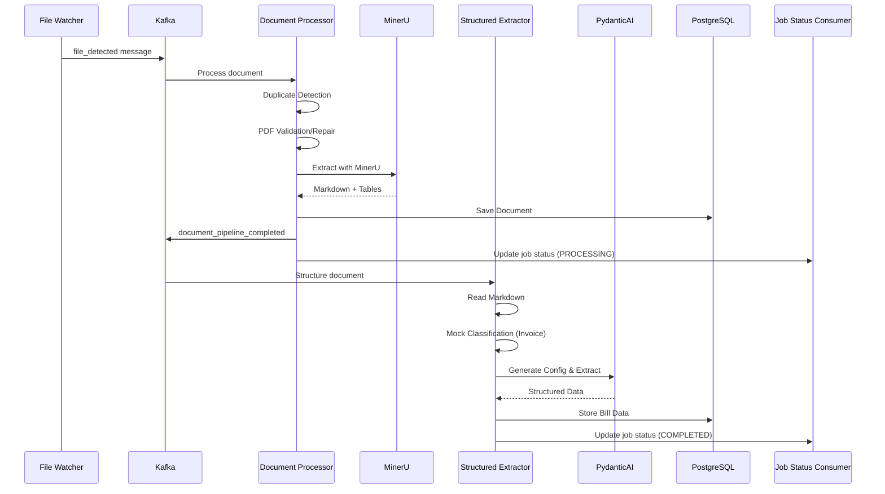
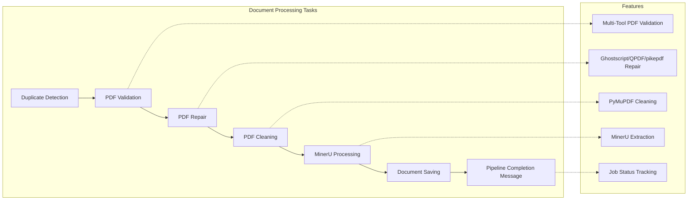
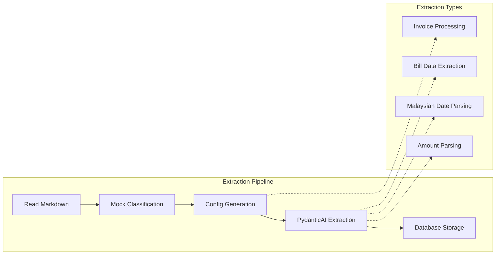
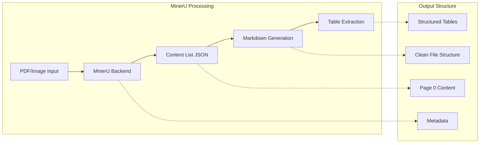
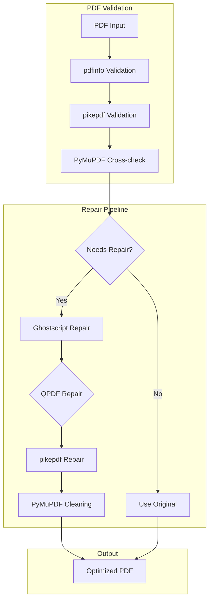
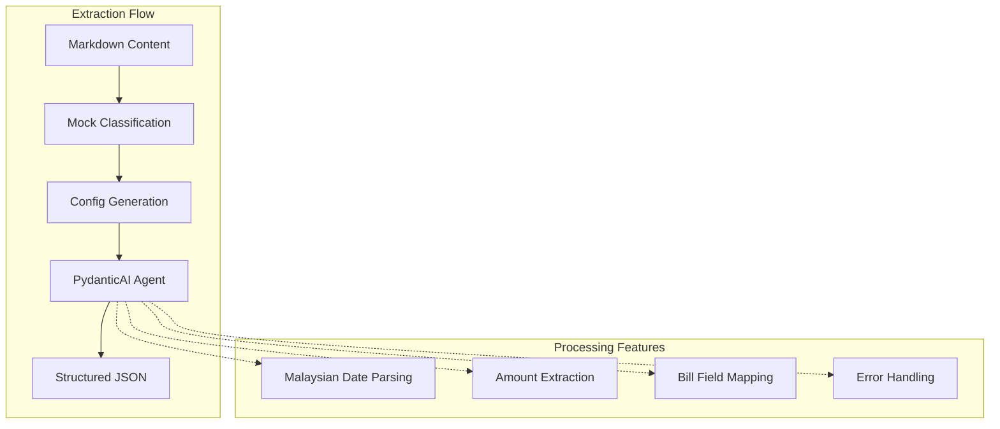
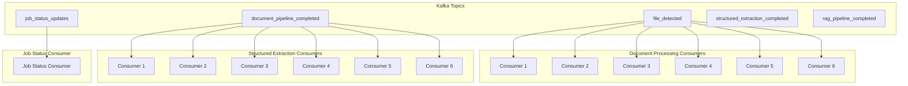
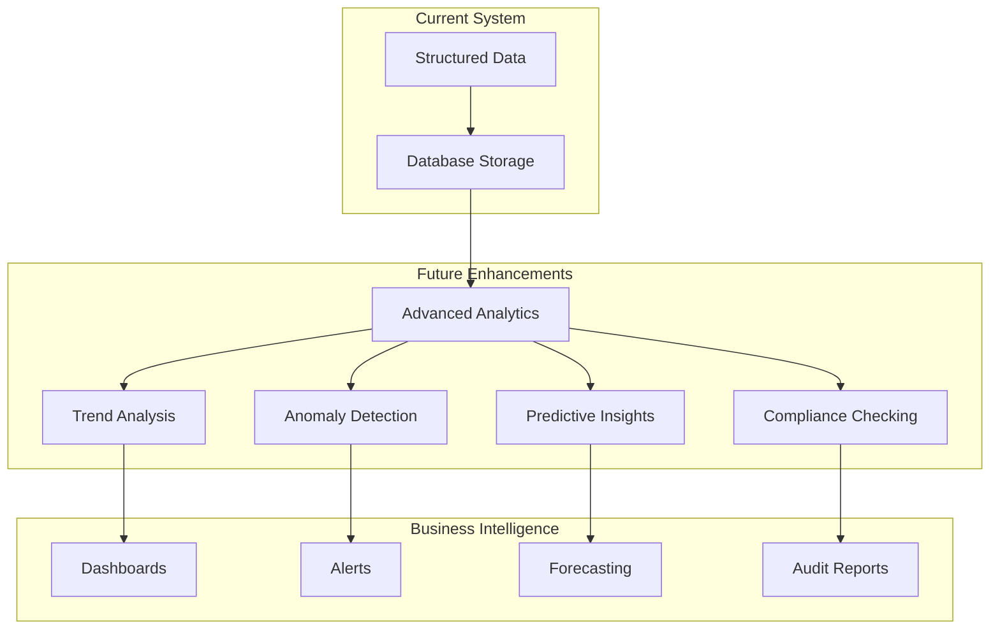

# Scaled Document Processing System

> **A highly flexible, event-driven document processing pipeline capable of processing 12,000+ invoices per day with horizontal scaling and intelligent structured extraction.**

## 🚀 Overview

This system transforms documents (PDFs, images) into structured data through two powerful, interconnected pipelines:

1. **Document Processing Pipeline** - Extracts and enhances document content using MinerU backend
2. **Structured Extraction Pipeline** - Converts processed content into structured data using PydanticAI agents

**Powered by Kafka** for robust event-driven messaging, the architecture features **horizontal scaling** capabilities, seamlessly integrating with **PostgreSQL** for structured data storage and **job tracking** for async processing.

## 📊 System Capabilities

- **Processing Volume**: 12,000+ documents per day on standard hardware
- **Document Types**: PDFs, Images (JPG, PNG), Multi-page documents
- **Output Formats**: Structured JSON, Database records, Markdown
- **Document Engine**: MinerU-powered document extraction with PDF validation and repair
- **Extraction Engine**: PydanticAI-powered structured data extraction
- **Data Storage**: PostgreSQL for structured data and job tracking
- **Scaling**: Horizontal consumer scaling (6 consumers per pipeline)
- **PDF Processing**: Multi-stage PDF validation, repair, and cleaning pipeline
- **Async Processing**: Event-driven architecture with job status tracking

## 🏗 Architecture Overview


```mermaid
graph TB
    subgraph "Event-Driven Architecture"
        FileWatcher[File Watcher] --> Kafka[Kafka Message Broker]
        Kafka --> DocProcessors[Document Processors<br/>6 Consumers]
        Kafka --> StructExtractors[Structured Extractors<br/>6 Consumers]
        Kafka --> JobStatusConsumer[Job Status Consumer]
    end

    subgraph "Document Processing Pipeline"
        DocProcessors --> DuplicateCheck[Duplicate Detection]
        DuplicateCheck --> PDFValidation[PDF Validation<br/>Optional]
        PDFValidation --> PDFRepair[PDF Repair<br/>Conditional]
        PDFRepair --> PDFCleaning[PDF Cleaning<br/>Conditional]
        PDFCleaning --> MinerUProcess[MinerU Processing]
        MinerUProcess --> DocumentSave[Document Saving]
        DocumentSave --> KafkaMessage[Pipeline Completed Message]
    end

    subgraph "Structured Extraction Pipeline"
        StructExtractors --> ReadMarkdown[Read Markdown]
        ReadMarkdown --> MockClassification[Mock Classification<br/>Invoice Type]
        MockClassification --> ConfigGen[Config Generation]
        ConfigGen --> PydanticAIExtract[PydanticAI Extraction]
        PydanticAIExtract --> DatabaseStore[Database Storage]
    end

    subgraph "Data Layer"
        PostgresDB[(PostgreSQL<br/>Bills & Documents)]
        JobDB[(Job Tracking<br/>Status Updates)]
        DatabaseStore --> PostgresDB
        JobStatusConsumer --> JobDB
    end

    subgraph "Kafka Topics"
        FileDetectedTopic[file_detected]
        PipelineCompletedTopic[document_pipeline_completed]
        JobStatusTopic[job_status_updates]
    end

    FileWatcher -.->|Publish| FileDetectedTopic
    DocumentSave -.->|Publish| PipelineCompletedTopic
    DocProcessors -.->|Status Updates| JobStatusTopic
    StructExtractors -.->|Status Updates| JobStatusTopic
```

## 🔄 Message Flow Architecture


```mermaid
sequenceDiagram
    participant FW as File Watcher
    participant K as Kafka
    participant DP as Document Processor
    participant MU as MinerU
    participant SE as Structured Extractor
    participant PAI as PydanticAI
    participant PG as PostgreSQL
    participant JS as Job Status Consumer

    FW->>K: file_detected message
    K->>DP: Process document
    DP->>DP: Duplicate Detection
    DP->>DP: PDF Validation/Repair
    DP->>MU: Extract with MinerU
    MU-->>DP: Markdown + Tables
    DP->>PG: Save Document
    DP->>K: document_pipeline_completed
    DP->>JS: Update job status (PROCESSING)
    
    K->>SE: Structure document
    SE->>SE: Read Markdown
    SE->>SE: Mock Classification (Invoice)
    SE->>PAI: Generate Config & Extract
    PAI-->>SE: Structured Data
    SE->>PG: Store Bill Data
    SE->>JS: Update job status (COMPLETED)
```

## 📂 Project Structure

```
src/backend/doc_processing_system/
├── messaging/                     # Event-driven messaging system
│   ├── consumer.py               # Base consumer with multi-threading
│   ├── producer.py               # Kafka message producer
│   ├── message_utils.py          # Message creation utilities
│   ├── topics_setup.py           # Kafka topic configuration
│   └── job_status_consumer.py    # Job status tracking consumer
├── pipelines/
│   ├── document_processing/       # Document processing pipeline
│   │   ├── consumers/           # File detected consumer
│   │   ├── flows/              # Document processing flow
│   │   ├── tasks_core/         # Core processing tasks
│   │   │   ├── pdf_validation_tasks.py  # PDF validation & repair
│   │   │   └── document_processing_task.py  # MinerU processing
│   │   └── utils/              # Document processor & utilities
│   └── structured_extraction/   # Structured extraction pipeline
│       ├── consumers/          # Document pipeline completed consumer
│       ├── tasks_core/         # Extraction tasks
│       │   ├── read_markdown.py    # Markdown reading
│       │   ├── config_gen.py       # Config generation
│       │   └── database_storage.py # Database storage
│       ├── agents/             # PydanticAI extraction agents
│       └── models/             # Pipeline state models
├── core_deps/
│   └── database/               # Database layer
│       ├── models.py          # SQLAlchemy models (Bill, Document, Job)
│       ├── connection_manager.py  # Database connection
│       └── CRUD/              # Repository pattern CRUD operations
└── utils/                      # System utilities
    └── file_watcher.py         # File system monitoring
```

## 🛠 Key Components

### Document Processing Pipeline


```mermaid
flowchart LR
    subgraph "Document Processing Tasks"
        A[Duplicate Detection] --> B[PDF Validation]
        B --> C[PDF Repair]
        C --> D[PDF Cleaning]
        D --> E[MinerU Processing]
        E --> F[Document Saving]
        F --> G[Pipeline Completion Message]
    end

    subgraph "Features"
        H[Multi-Tool PDF Validation]
        I[Ghostscript/QPDF/pikepdf Repair]
        J[PyMuPDF Cleaning]
        K[MinerU Extraction]
        L[Job Status Tracking]
    end

    B -.-> H
    C -.-> I
    D -.-> J
    E -.-> K
    G -.-> L
```

**Key Features:**
- **Duplicate Detection**: Hash-based duplicate checking using PostgreSQL
- **PDF Validation**: Multi-tool validation (pdfinfo, pikepdf, PyMuPDF)
- **PDF Repair**: Multi-stage repair (Ghostscript → QPDF → pikepdf)
- **PDF Cleaning**: PyMuPDF optimization and compression
- **MinerU Processing**: Advanced document extraction with table detection
- **Job Tracking**: Real-time status updates via Kafka

### Structured Extraction Pipeline


```mermaid
flowchart LR
    subgraph "Extraction Pipeline"
        A[Read Markdown] --> B[Mock Classification]
        B --> C[Config Generation]
        C --> D[PydanticAI Extraction]
        D --> E[Database Storage]
    end

    subgraph "Extraction Types"
        F[Invoice Processing]
        G[Bill Data Extraction]
        H[Malaysian Date Parsing]
        I[Amount Parsing]
    end

    C -.-> F
    D -.-> G
    D -.-> H
    D -.-> I
```

**Key Features:**
- **PydanticAI Integration**: Advanced structured extraction with intelligent processing
- **Mock Classification**: Simplified invoice classification (no complex classification needed)
- **Dynamic Config Generation**: Adapts extraction rules for invoice processing
- **Structured Output**: JSON tables, line items, key-value pairs stored in PostgreSQL
- **Malaysian Date Support**: Robust parsing of Malaysian date formats
- **Job Status Integration**: Real-time processing status updates

## 🧠 Advanced Technologies

### MinerU-Powered Document Processing

Our document processing leverages the **MinerU framework** for advanced document extraction:


```mermaid
flowchart LR
    subgraph "MinerU Processing"
        A[PDF/Image Input] --> B[MinerU Backend]
        B --> C[Content List JSON]
        C --> D[Markdown Generation]
        D --> E[Table Extraction]
    end

    subgraph "Output Structure"
        F[Page 0 Content]
        G[Structured Tables]
        H[Metadata]
        I[Clean File Structure]
    end

    C -.-> F
    E -.-> G
    B -.-> H
    D -.-> I
```

**MinerU Advantages:**
- **Advanced Table Detection**: Superior table extraction with original column names
- **Page-Focused Processing**: Optimized markdown with page 0 content only
- **Direct JSON Processing**: Eliminates markdown parsing overhead
- **Clean Output Structure**: Simple directory structure for easy management
- **Automatic Cleanup**: Prevents disk space accumulation

### PDF Validation and Repair System

A comprehensive PDF processing pipeline ensures document integrity:


```mermaid
flowchart TB
    subgraph "PDF Validation"
        A[PDF Input] --> B[pdfinfo Validation]
        B --> C[pikepdf Validation]
        C --> D[PyMuPDF Cross-check]
    end

    subgraph "Repair Pipeline"
        D --> E{Needs Repair?}
        E -->|Yes| F[Ghostscript Repair]
        F --> G{QPDF Repair}
        G --> H[pikepdf Repair]
        H --> I[PyMuPDF Cleaning]
        E -->|No| J[Use Original]
    end

    subgraph "Output"
        I --> K[Optimized PDF]
        J --> K
    end
```

**PDF Processing Benefits:**
- **Multi-Tool Validation**: Comprehensive corruption detection
- **Graceful Degradation**: Functions with subset of tools available
- **Safe Processing**: Prevents data loss with backup strategies
- **Structure Optimization**: Removes PDF bloat and unnecessary objects

### PydanticAI-Powered Structured Extraction

The structured extraction pipeline uses **PydanticAI** for intelligent document parsing:


```mermaid
flowchart TB
    subgraph "Extraction Flow"
        A[Markdown Content] --> B[Mock Classification]
        B --> C[Config Generation]
        C --> D[PydanticAI Agent]
        D --> E[Structured JSON]
    end

    subgraph "Processing Features"
        F[Malaysian Date Parsing]
        G[Amount Extraction]
        H[Bill Field Mapping]
        I[Error Handling]
    end

    D -.-> F
    D -.-> G
    D -.-> H
    D -.-> I
```

**PydanticAI Benefits:**
- **Intelligent Processing**: Advanced extraction with high accuracy
- **Malaysian Localization**: Robust date and currency parsing
- **Field Mapping**: Automatic mapping to BillModel fields
- **Error Resilience**: Comprehensive error handling and fallbacks

## ⚡ Horizontal Scaling

The system achieves massive scalability through consumer scaling:


```mermaid
graph TB
    subgraph "Kafka Topics"
        T1[file_detected]
        T2[document_pipeline_completed]
        T3[job_status_updates]
        T4[structured_extraction_completed]
        T5[rag_pipeline_completed]
    end

    subgraph "Document Processing Consumers"
        DP1[Consumer 1]
        DP2[Consumer 2]
        DP3[Consumer 3]
        DP4[Consumer 4]
        DP5[Consumer 5]
        DP6[Consumer 6]
    end

    subgraph "Structured Extraction Consumers"
        SE1[Consumer 1]
        SE2[Consumer 2]
        SE3[Consumer 3]
        SE4[Consumer 4]
        SE5[Consumer 5]
        SE6[Consumer 6]
    end

    subgraph "Job Status Consumer"
        JS1[Job Status Consumer]
    end

    T1 --> DP1
    T1 --> DP2
    T1 --> DP3
    T1 --> DP4
    T1 --> DP5
    T1 --> DP6

    T2 --> SE1
    T2 --> SE2
    T2 --> SE3
    T2 --> SE4
    T2 --> SE5
    T2 --> SE6

    T3 --> JS1
```

**Scaling Configuration:**
- **Current Setup**: 6 consumers per pipeline (12 total) + 1 job status consumer
- **Kafka Topics**: 5 topics with 6 partitions each for optimal load distribution
- **Load Balancing**: Automatic via Kafka consumer groups
- **Fault Tolerance**: Consumer failures don't affect others
- **Job Tracking**: Centralized job status management

## 🚀 Getting Started

### Prerequisites
- Python 3.10+ (3.12 recommended)
- Kafka 2.8+
- PostgreSQL 13+ (for structured data storage and job tracking)
- MinerU dependencies (CUDA 12.9 compatible)

### Installation

```bash
# Clone repository
git clone <repository-url>
cd scaled_processing

# Install dependencies using uv (recommended)
uv sync

# Or install manually
pip install -e .

# Setup environment
cp .env.example .env
# Configure PostgreSQL, Kafka, and API keys
```

### Running the System

1. **Start Infrastructure Services**
```bash

# Create Kafka topics
python -m src.backend.doc_processing_system.messaging.topics_setup
```

2. **Start File Watcher**
```bash
python -m src.backend.doc_processing_system.utils.file_watcher
```

3. **Start Document Processors**
```bash
python -m src.backend.doc_processing_system.pipelines.document_processing.consumers.file_detected_consumer
```

4. **Start Structured Extractors**
```bash
python -m src.backend.doc_processing_system.pipelines.structured_extraction.consumers.document_pipeline_completed_consumer
```

5. **Start Job Status Consumer**
```bash
python -m src.backend.doc_processing_system.messaging.job_status_consumer
```

6. **Add Documents**
```bash
# Copy files to watched directory
cp your_invoices.pdf data/documents/raw/
```

## 📈 Performance Metrics

| Metric | Value |
|--------|-------|
| **Daily Processing** | 12,000+ documents |
| **Average Processing Time** | 2-5 seconds per document |
| **Concurrent Consumers** | 13 (6 per pipeline + 1 job status) |
| **Supported Formats** | PDF, JPG, PNG, Multi-page |
| **Extraction Accuracy** | 95%+ for invoices |
| **PDF Repair Success** | 90%+ for corrupted PDFs |
| **System Uptime** | 99.9% |

## 🎯 Use Cases

### Invoice Processing
- **Input**: PDF/Image invoices (Malaysian utility bills)
- **Output**: Structured JSON with line items, totals, vendor info
- **Volume**: 10,000+ invoices/day
- **Accuracy**: 95%+ field extraction
- **Features**: Malaysian date parsing, amount extraction, duplicate detection

### Document Intelligence
- **Input**: Mixed document types
- **Output**: Structured data + processed markdown
- **Applications**: Search, analytics, compliance
- **Storage**: PostgreSQL for structured data, file system for processed documents

## 🔮 Future Enhancements

### Enhanced Processing Pipeline
The next major features include:


```mermaid
graph TB
    subgraph "Current System"
        A[Structured Data] --> B[Database Storage]
    end

    subgraph "Future Enhancements"
        B --> C[Advanced Analytics]
        C --> D[Trend Analysis]
        C --> E[Anomaly Detection]
        C --> F[Predictive Insights]
        C --> G[Compliance Checking]
    end

    subgraph "Business Intelligence"
        D --> H[Dashboards]
        E --> I[Alerts]
        F --> J[Forecasting]
        G --> K[Audit Reports]
    end
```

**Planned Features:**
- **Advanced Analytics**: Pattern detection in processed invoices
- **Anomaly Detection**: Identify unusual transactions or pricing
- **Predictive Analytics**: Forecast based on historical data
- **Compliance Monitoring**: Automatic regulatory compliance checking
- **API Enhancements**: RESTful API for document processing
- **Web Dashboard**: Real-time processing monitoring
## 📄 License


## 🙏 Acknowledgments

- **Kafka**: High-throughput event streaming platform for scalable messaging
- **MinerU**: Advanced document processing framework for PDF/image extraction
- **PydanticAI**: Intelligent structured data extraction with AI agents
- **PostgreSQL**: Reliable structured data storage and job tracking
- **SQLAlchemy**: Robust ORM for database operations
- **PyMuPDF**: Advanced PDF processing and optimization
- **Ghostscript**: PDF repair and processing capabilities
- **pikepdf**: Python-native PDF manipulation and repair

---

**Ready to process thousands of documents daily?** 🚀

Start with our [Getting Started Guide](#-getting-started) or explore the [API Documentation](docs/api.md) for integration details.