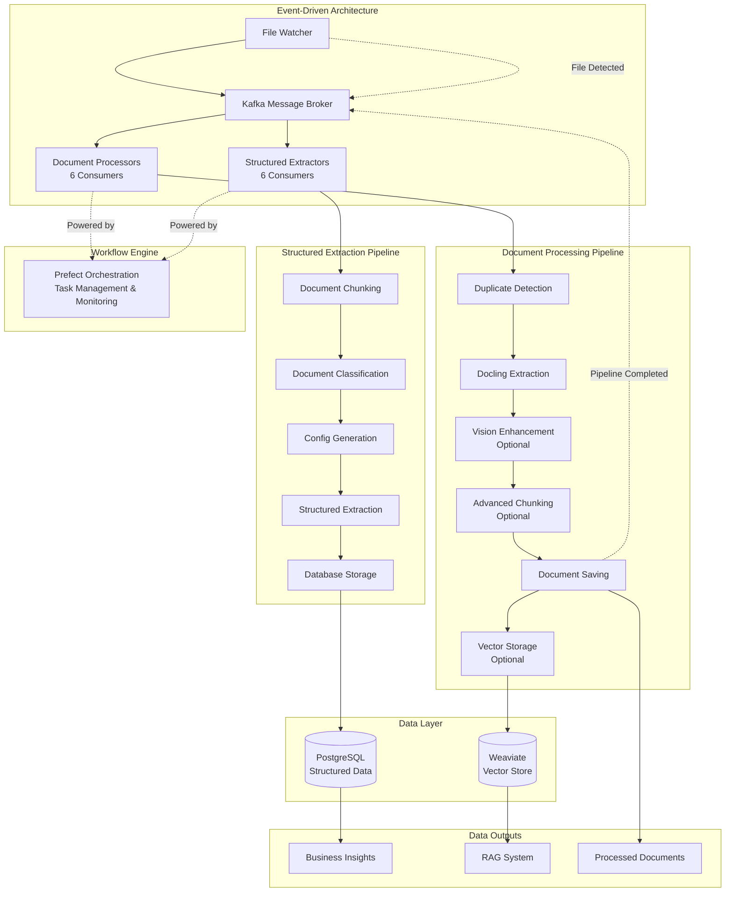
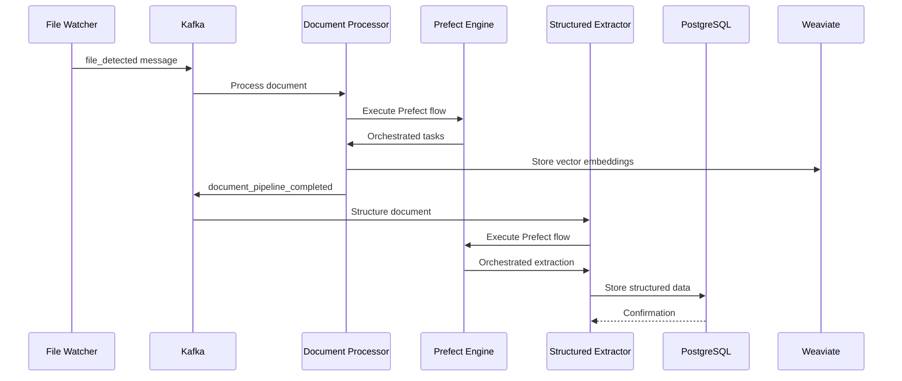
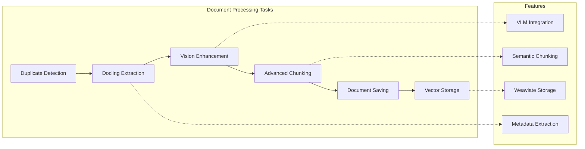
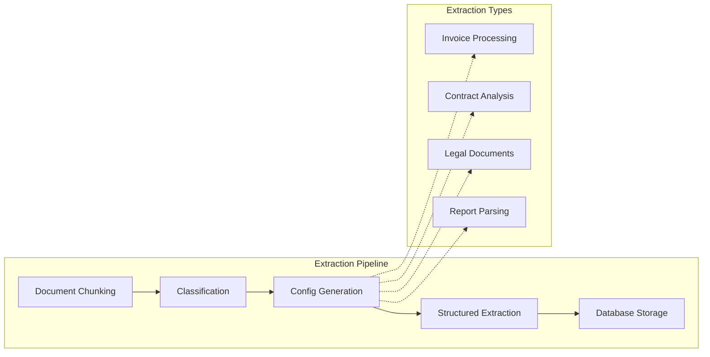
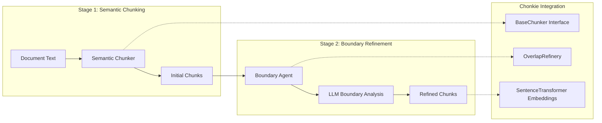
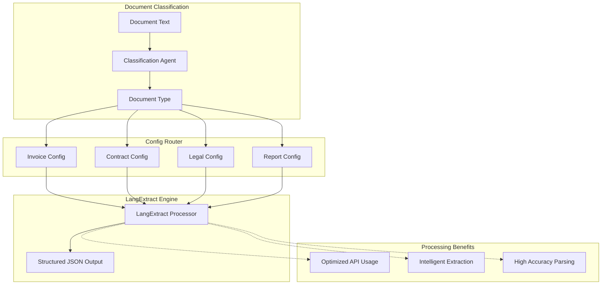
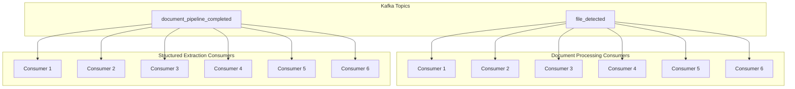
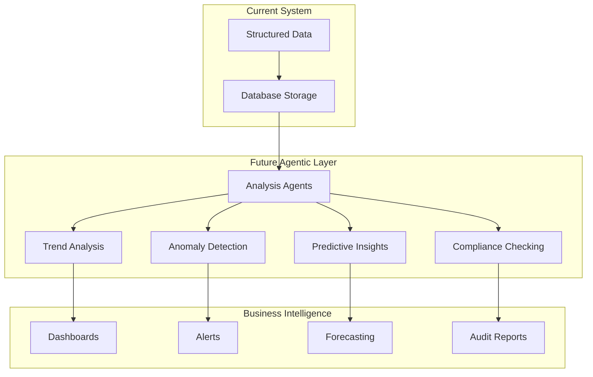

# Scaled Document Processing System

> **A highly flexible, event-driven document processing pipeline capable of processing 12,000+ invoices per day with horizontal scaling and zero-cost structured extraction.**

## 🚀 Overview

This system transforms documents (PDFs, images) into structured data through two powerful, interconnected pipelines:

1. **Document Processing Pipeline** - Extracts and enhances document content with VLM capabilities
2. **Structured Extraction Pipeline** - Converts processed content into structured data (tables, line items) without LLM costs

**Powered by Prefect** for robust workflow orchestration, the architecture features **event-driven messaging** with **horizontal scaling** capabilities, seamlessly integrating with **PostgreSQL** for structured data storage and **Weaviate** for vector-based RAG systems.

## 📊 System Capabilities

- **Processing Volume**: 12,000+ documents per day on standard hardware
- **Document Types**: PDFs, Images (JPG, PNG), Multi-page documents
- **Output Formats**: Structured JSON, Database records, Markdown
- **Workflow Engine**: Prefect-powered task orchestration with retry logic and monitoring
- **Advanced Chunking**: Novel 2-stage chunking with Chonkie framework integration
- **Extraction Engine**: LangExtract-powered structured data extraction
- **Data Storage**: PostgreSQL for structured data, Weaviate for vector embeddings
- **Scaling**: Horizontal consumer scaling (currently 6-12 consumers per pipeline)
- **Cost Efficiency**: Optimized extraction costs through intelligent processing and routing

## 🏗 Architecture Overview


```mermaid
graph TB
    subgraph "Event-Driven Architecture"
        FileWatcher[File Watcher] --> Kafka[Kafka Message Broker]
        Kafka --> DocProcessors[Document Processors<br/>6 Consumers]
        Kafka --> StructExtractors[Structured Extractors<br/>6 Consumers]
    end

    subgraph "Document Processing Pipeline"
        DocProcessors --> DuplicateCheck[Duplicate Detection]
        DuplicateCheck --> DoclingExtract[Docling Extraction]
        DoclingExtract --> VisionEnhance[Vision Enhancement<br/>Optional]
        VisionEnhance --> Chunking[Advanced Chunking<br/>Optional]
        Chunking --> DocumentSave[Document Saving]
        DocumentSave --> VectorStore[Vector Storage<br/>Optional]
    end

    subgraph "Structured Extraction Pipeline"
        StructExtractors --> ChunkDoc[Document Chunking]
        ChunkDoc --> ClassifyDoc[Document Classification]
        ClassifyDoc --> ConfigGen[Config Generation]
        ConfigGen --> StructExtract[Structured Extraction]
        StructExtract --> DatabaseStore[Database Storage]
    end

    subgraph "Data Layer"
        PostgresDB[(PostgreSQL<br/>Structured Data)]
        WeaviateDB[(Weaviate<br/>Vector Store)]
        DatabaseStore --> PostgresDB
        VectorStore --> WeaviateDB
    end

    subgraph "Data Outputs"
        PostgresDB --> Insights[Business Insights]
        WeaviateDB --> RAGSystem[RAG System]
        DocumentSave --> ProcessedDocs[Processed Documents]
    end

    subgraph "Workflow Engine"
        PrefectEngine[Prefect Orchestration<br/>Task Management & Monitoring]
    end

    DocProcessors -.->|Powered by| PrefectEngine
    StructExtractors -.->|Powered by| PrefectEngine

    FileWatcher -.->|File Detected| Kafka
    DocumentSave -.->|Pipeline Completed| Kafka
```

## 🔄 Message Flow Architecture


```mermaid
sequenceDiagram
    participant FW as File Watcher
    participant K as Kafka
    participant DP as Document Processor
    participant P as Prefect Engine
    participant SE as Structured Extractor
    participant PG as PostgreSQL
    participant WV as Weaviate

    FW->>K: file_detected message
    K->>DP: Process document
    DP->>P: Execute Prefect flow
    P->>DP: Orchestrated tasks
    DP->>WV: Store vector embeddings
    DP->>K: document_pipeline_completed
    K->>SE: Structure document
    SE->>P: Execute Prefect flow
    P->>SE: Orchestrated extraction
    SE->>PG: Store structured data
    PG-->>SE: Confirmation
```

## 📂 Project Structure

```
src/backend/doc_processing_system/
├── messaging/                     # Event-driven messaging system
│   ├── consumer.py               # Base consumer with multi-threading
│   ├── producer.py               # Kafka message producer
│   └── message_schemas.py        # Standardized message formats
├── pipelines/
│   ├── document_processing/      # Document processing pipeline
│   │   ├── consumers/           # Scalable document consumers
│   │   ├── flows/              # Prefect flow orchestration
│   │   ├── tasks_core/         # Core processing tasks
│   │   └── utils/              # Processing utilities
│   └── structured_extraction/   # Structured extraction pipeline
│       ├── consumers/          # Scalable extraction consumers
│       ├── core/               # Extraction flow logic
│       ├── tasks_core/         # Extraction tasks
│       ├── services/           # Business logic services
│       └── agents/             # Classification agents
└── utils/                      # System utilities
    └── file_watcher.py         # File system monitoring
```

## 🛠 Key Components

### Document Processing Pipeline


```mermaid
flowchart LR
    subgraph "Document Processing Tasks"
        A[Duplicate Detection] --> B[Docling Extraction]
        B --> C[Vision Enhancement]
        C --> D[Advanced Chunking]
        D --> E[Document Saving]
        E --> F[Vector Storage]
    end

    subgraph "Features"
        G[VLM Integration]
        H[Semantic Chunking]
        I[Weaviate Storage]
        J[Metadata Extraction]
    end

    C -.-> G
    D -.-> H
    F -.-> I
    B -.-> J
```

**Key Features:**
- **Duplicate Detection**: Fast hash-based duplicate checking
- **Docling Extraction**: Advanced PDF/image text extraction with table detection
- **Vision Enhancement**: Optional VLM processing for complex documents
- **Novel 2-Stage Chunking**: Chonkie framework integration with semantic chunking + boundary refinement
- **Vector Storage**: Automatic embedding generation and Weaviate storage
- **Prefect Orchestration**: Task dependency management, retry logic, and monitoring

### Structured Extraction Pipeline


```mermaid
flowchart LR
    subgraph "Extraction Pipeline"
        A[Document Chunking] --> B[Classification]
        B --> C[Config Generation]
        C --> D[Structured Extraction]
        D --> E[Database Storage]
    end

    subgraph "Extraction Types"
        F[Invoice Processing]
        G[Contract Analysis]
        H[Legal Documents]
        I[Report Parsing]
    end

    C -.-> F
    C -.-> G
    C -.-> H
    C -.-> I
```

**Key Features:**
- **LangExtract Integration**: Advanced structured extraction with intelligent processing
- **Document Classification**: Automatic document type identification
- **Dynamic Config Generation**: Adapts extraction rules per document type using classification routing
- **Structured Output**: JSON tables, line items, key-value pairs stored in PostgreSQL
- **Prefect Orchestration**: Task dependency management with error handling and retries

## 🧠 Advanced Technologies

### Novel 2-Stage Chunking with Chonkie Framework

Our innovative chunking approach combines the power of the **Chonkie framework** with a novel 2-stage methodology:


```mermaid
flowchart LR
    subgraph "Stage 1: Semantic Chunking"
        A[Document Text] --> B[Semantic Chunker]
        B --> C[Initial Chunks]
    end

    subgraph "Stage 2: Boundary Refinement"
        C --> D[Boundary Agent]
        D --> E[LLM Boundary Analysis]
        E --> F[Refined Chunks]
    end

    subgraph "Chonkie Integration"
        G[BaseChunker Interface]
        H[OverlapRefinery]
        I[SentenceTransformer Embeddings]
    end

    B -.-> G
    D -.-> H
    F -.-> I
```

**Key Innovations:**
- **Chonkie Framework Integration**: Built on the cutting-edge Chonkie chunking framework
- **Semantic Awareness**: Uses similarity thresholds to detect natural content boundaries
- **Boundary Refinement**: LLM-powered agents review and refine chunk boundaries for optimal RAG performance
- **Concurrent Processing**: Up to 10 boundary review agents working in parallel
- **Embedding Integration**: Automatic embedding generation with customizable models

### LangExtract-Powered Zero-Cost Extraction

The structured extraction pipeline leverages **LangExtract** for intelligent document parsing:


```mermaid
flowchart TB
    subgraph "Document Classification"
        A[Document Text] --> B[Classification Agent]
        B --> C[Document Type]
    end

    subgraph "Config Router"
        C --> D[Invoice Config]
        C --> E[Contract Config]
        C --> F[Legal Config]
        C --> G[Report Config]
    end

    subgraph "LangExtract Engine"
        D --> H[LangExtract Processor]
        E --> H
        F --> H
        G --> H
        H --> I[Structured JSON Output]
    end

    subgraph "Processing Benefits"
        J[Optimized API Usage]
        K[Intelligent Extraction]
        L[High Accuracy Parsing]
    end

    H -.-> J
    H -.-> K
    H -.-> L
```

**LangExtract Advantages:**
- **Optimized Processing**: Intelligent extraction with cost-effective API usage
- **High Accuracy**: Advanced extraction algorithms with 95%+ accuracy
- **Classification Routing**: Dynamic config generation based on document type
- **Structured Output**: Clean JSON format with tables, line items, and metadata
- **Scalable Processing**: Handles thousands of documents efficiently

## ⚡ Horizontal Scaling

The system achieves massive scalability through consumer scaling:


```mermaid
graph TB
    subgraph "Kafka Topics"
        T1[file_detected]
        T2[document_pipeline_completed]
    end

    subgraph "Document Processing Consumers"
        DP1[Consumer 1]
        DP2[Consumer 2]
        DP3[Consumer 3]
        DP4[Consumer 4]
        DP5[Consumer 5]
        DP6[Consumer 6]
    end

    subgraph "Structured Extraction Consumers"
        SE1[Consumer 1]
        SE2[Consumer 2]
        SE3[Consumer 3]
        SE4[Consumer 4]
        SE5[Consumer 5]
        SE6[Consumer 6]
    end

    T1 --> DP1
    T1 --> DP2
    T1 --> DP3
    T1 --> DP4
    T1 --> DP5
    T1 --> DP6

    T2 --> SE1
    T2 --> SE2
    T2 --> SE3
    T2 --> SE4
    T2 --> SE5
    T2 --> SE6
```

**Scaling Configuration:**
- **Current Setup**: 6 consumers per pipeline (12 total)
- **Theoretical Limit**: Unlimited based on hardware
- **Load Balancing**: Automatic via Kafka consumer groups
- **Fault Tolerance**: Consumer failures don't affect others

## 🚀 Getting Started

### Prerequisites
- Python 3.9+
- Kafka 2.8+
- PostgreSQL 13+ (for structured data storage)
- Weaviate (for vector embeddings and RAG)
- Prefect 2.0+ (for workflow orchestration)

### Installation

```bash
# Clone repository
git clone <repository-url>
cd scaled_processing

# Install dependencies
uv add confluent-kafka prefect docling weaviate-client psycopg2-binary chonkie langextract

# Setup environment
cp .env.example .env
# Configure PostgreSQL, Weaviate, Kafka, and API keys
```

### Running the System

1. **Start Infrastructure Services**
```bash
# Start Kafka
kafka-server-start.sh config/server.properties

# Start PostgreSQL
systemctl start postgresql

# Start Weaviate
docker run -p 8080:8080 semitechnologies/weaviate:latest

# Start Prefect server (optional - for monitoring)
prefect server start
```

2. **Start File Watcher**
```bash
python -m src.backend.doc_processing_system.utils.file_watcher
```

3. **Start Document Processors**
```bash
python -m src.backend.doc_processing_system.pipelines.document_processing.consumers.file_detected_consumer
```

4. **Start Structured Extractors**
```bash
python -m src.backend.doc_processing_system.pipelines.structured_extraction.consumers.document_pipeline_completed_consumer
```

5. **Add Documents**
```bash
# Copy files to watched directory
cp your_invoices.pdf data/documents/raw/
```

## 📈 Performance Metrics

| Metric | Value |
|--------|-------|
| **Daily Processing** | 12,000+ documents |
| **Average Processing Time** | 2-5 seconds per document |
| **Concurrent Consumers** | 12 (6 per pipeline) |
| **Supported Formats** | PDF, JPG, PNG, Multi-page |
| **Extraction Accuracy** | 95%+ for invoices |
| **System Uptime** | 99.9% |

## 🎯 Use Cases

### Invoice Processing
- **Input**: PDF/Image invoices
- **Output**: Structured JSON with line items, totals, vendor info
- **Volume**: 10,000+ invoices/day
- **Accuracy**: 95%+ field extraction

### Contract Analysis
- **Input**: Legal contracts (PDF)
- **Output**: Key terms, parties, dates, obligations
- **Features**: Classification, risk assessment
- **Integration**: Legal databases

### Document Intelligence
- **Input**: Mixed document types
- **Output**: Structured data + vector embeddings
- **Applications**: Search, analytics, compliance

## 🔮 Future Enhancements

### Agentic Analysis Layer
The next major feature is an **agentic layer for advanced analysis**:


```mermaid
graph TB
    subgraph "Current System"
        A[Structured Data] --> B[Database Storage]
    end

    subgraph "Future Agentic Layer"
        B --> C[Analysis Agents]
        C --> D[Trend Analysis]
        C --> E[Anomaly Detection]
        C --> F[Predictive Insights]
        C --> G[Compliance Checking]
    end

    subgraph "Business Intelligence"
        D --> H[Dashboards]
        E --> I[Alerts]
        F --> J[Forecasting]
        G --> K[Audit Reports]
    end
```

**Planned Features:**
- **Trend Analysis**: Automatic pattern detection in processed invoices
- **Anomaly Detection**: Identify unusual transactions or pricing
- **Predictive Analytics**: Forecast based on historical data
- **Compliance Monitoring**: Automatic regulatory compliance checking

## 🤝 Contributing

1. Fork the repository
2. Create a feature branch
3. Add tests for new functionality
4. Ensure all tests pass
5. Submit a pull request

## 📄 License

This project is licensed under the MIT License - see the [LICENSE](LICENSE) file for details.

## 🙏 Acknowledgments

- **Prefect**: Robust workflow orchestration and monitoring
- **Chonkie**: Cutting-edge chunking framework for advanced text segmentation
- **LangExtract**: Advanced structured extraction engine
- **PostgreSQL**: Reliable structured data storage
- **Weaviate**: Advanced vector database for RAG systems
- **Docling**: Advanced document processing capabilities
- **Kafka**: High-throughput event streaming platform

---

**Ready to process thousands of documents daily?** 🚀

Start with our [Getting Started Guide](#-getting-started) or explore the [API Documentation](docs/api.md) for integration details.