# 🚀 Scaled Processing System

> **Advanced Document Processing Platform with Parallel RAG and Structured Extraction**

A comprehensive, event-driven document processing system that combines **Retrieval-Augmented Generation (RAG)** and **structured data extraction** workflows for intelligent document analysis at scale.

[](https://python.org)
[](https://fastapi.tiangolo.com)
[](https://github.com/pydantic/pydantic-ai)
[](https://github.com/langchain-ai/langgraph)

## 📋 Table of Contents

- [🎯 System Overview](#-system-overview)
- [🏗️ Architecture](#️-architecture)
- [🔄 Processing Workflows](#-processing-workflows)
- [💾 Data Flow](#-data-flow)
- [🚀 Key Features](#-key-features)
- [🛠️ Technology Stack](#️-technology-stack)
- [📦 Installation](#-installation)
- [🎮 Quick Start](#-quick-start)
- [📖 Documentation](#-documentation)

## 🎯 System Overview

The Scaled Processing System is designed to handle large-scale document processing with two parallel, intelligent workflows:

```mermaid
graph TB
    subgraph "Document Upload"
        A[📄 Multi-Format Documents] --> B[�️ Vision-Enhanced Parser (Docling)]
        B --> C[� Content Validator]
        C --> D[🎯 Parallel Workflow Trigger]
    end
    
    subgraph "Parallel Processing"
        D --> E[🔤 RAG Pipeline]
        D --> F[📋 Structured Extraction]
    end
    
    subgraph "Query System"
        E --> G[🤖 Semantic Search]
        F --> H[🎯 Field-Based Query]
        G --> I[🔀 Hybrid Query Engine]
        H --> I
    end
    
    I --> J[✨ Intelligent Responses]
    
    style A fill:#e1f5fe
    style D fill:#fff3e0
    style I fill:#f3e5f5
    style J fill:#e8f5e8
```

## 🏗️ Architecture

### High-Level System Architecture

```mermaid
graph TD
    subgraph "Frontend Layer"
        UI[🖥️ Web Interface]
        API[🔌 REST API]
    end
    
    subgraph "Processing Layer"
        subgraph "Document Ingestion"
            UPLOAD[📤 Upload Service]
            PARSER[�️ Docling Processor]
        end
        
        subgraph "RAG Workflow"
            CHUNK[✂️ Semantic Chunker]
            EMBED[🧠 Embedding Generator]
            VECTOR[📊 Vector Store]
        end
        
        subgraph "Structured Extraction"
            FIELD[🔍 Field Discovery]
            AGENT[🤖 Agent Swarm]
            EXTRACT[📋 Data Extractor]
        end
        
        subgraph "Query Processing"
            ROUTE[🛤️ Query Router]
            RAG_Q[🔤 RAG Query Engine]
            STRUCT_Q[📊 Structured Query Engine]
            HYBRID[🔀 Hybrid Fusion]
        end
    end
    
    subgraph "Event Streaming"
        KAFKA[📡 Kafka Event Bus]
    end
    
    subgraph "Data Layer"
        POSTGRES[🐘 PostgreSQL]
        CHROMA[🎨 ChromaDB]
        REDIS[🔴 Redis Cache]
    end
    
    subgraph "Orchestration"
        PREFECT[🔄 Prefect Flows]
        LANGGRAPH[🕸️ LangGraph Agents]
    end
    
    UI --> API
    API --> UPLOAD
    UPLOAD --> PARSER
    PARSER --> KAFKA
    
    KAFKA --> CHUNK
    KAFKA --> FIELD
    
    CHUNK --> EMBED
    EMBED --> VECTOR
    VECTOR --> CHROMA
    
    FIELD --> AGENT
    AGENT --> EXTRACT
    EXTRACT --> POSTGRES
    
    API --> ROUTE
    ROUTE --> RAG_Q
    ROUTE --> STRUCT_Q
    RAG_Q --> HYBRID
    STRUCT_Q --> HYBRID
    
    RAG_Q --> CHROMA
    STRUCT_Q --> POSTGRES
    
    PREFECT --> CHUNK
    PREFECT --> FIELD
    LANGGRAPH --> AGENT
    
    style KAFKA fill:#fff3e0
    style POSTGRES fill:#e3f2fd
    style CHROMA fill:#f3e5f5
    style HYBRID fill:#e8f5e8
```



### Event-Driven Architecture Flow

The system uses an event-driven architecture to decouple services and enable parallel processing. When a document is uploaded, it triggers two independent workflows that run simultaneously.


## 🔄 Processing Workflows

### RAG (Retrieval-Augmented Generation) Pipeline

```mermaid
flowchart LR
    subgraph "RAG Processing Pipeline"
        A[📄 Document] --> B[✂️ Semantic Chunking]
        B --> C[🧠 Embedding Generation]
        C --> D[✅ Vector Validation]
        D --> E[📊 ChromaDB Storage]
        E --> F[🔍 Similarity Search]
        F --> G[🤖 LLM Generation]
        G --> H[✨ Contextual Response]
    end
    
    subgraph "Scaling Strategy"
        I[📡 Kafka Partitions] --> J[⚡ Parallel Consumers]
        J --> K[🔄 Load Distribution]
        K --> L[📈 Horizontal Scaling]
    end
    
    B -.-> I
    
    style A fill:#e1f5fe
    style H fill:#e8f5e8
    style L fill:#fff3e0
```



### Structured Extraction Workflow

```mermaid
flowchart TD
    subgraph "Field Discovery Phase"
        A[📄 Document] --> B{📏 Page Count?}
        B -->|≤ 50 pages| C[🎯 Single Agent<br/>8 page samples]
        B -->|> 50 pages| D[🎯 3 Sequential Agents<br/>15 page samples each]
        
        C --> E[🔍 Field Specifications]
        D --> F[🔍 Agent 1: Initial Fields]
        F --> G[🔍 Agent 2: Missing Fields]
        G --> H[🔍 Agent 3: Final Fields]
        H --> E
    end
    
    subgraph "Agent Scaling Phase"
        E --> I{📊 Document Size?}
        I -->|< 20 pages| J[🤖 2 Extraction Agents]
        I -->|20-100 pages| K[🤖 5 Extraction Agents]
        I -->|> 100 pages| L[🤖 10 Extraction Agents]
    end
    
    subgraph "Parallel Extraction"
        J --> M[📋 Page Range Processing]
        K --> M
        L --> M
        M --> N[💾 PostgreSQL Storage]
        N --> O[✅ Quality Validation]
        O --> P[📊 Confidence Scoring]
    end
    
    style A fill:#e1f5fe
    style E fill:#fff3e0
    style P fill:#e8f5e8
```



### Hybrid Query Processing

```mermaid
flowchart TB
    subgraph "Query Input"
        A[👤 User Query] --> B[🔍 Query Analysis]
        B --> C{🎯 Query Type?}
    end
    
    subgraph "Processing Paths"
        C -->|Semantic| D[🔤 RAG Engine]
        C -->|Structured| E[📊 Field Engine]
        C -->|Hybrid| F[🔀 Parallel Processing]
        
        F --> G[🔤 RAG Search]
        F --> H[📊 Structured Filter]
    end
    
    subgraph "Response Fusion"
        D --> I[✨ RAG Response]
        E --> J[📋 Structured Response]
        G --> K[🔀 Fusion Algorithm]
        H --> K
        K --> L[🎯 Weighted Combination]
        L --> M[📊 Confidence Scoring]
    end
    
    subgraph "Output"
        I --> N[📤 Final Response]
        J --> N
        M --> N
        N --> O[👤 User Interface]
    end
    
    style A fill:#e1f5fe
    style C fill:#fff3e0
    style L fill:#f3e5f5
    style O fill:#e8f5e8
```



## 💾 Data Flow

### Multi-Database Strategy


### Message Flow Architecture

```mermaid
graph LR
    subgraph "Kafka Topics"
        A[📤 document-received]
        B[✂️ chunking-complete]
        C[🧠 embedding-ready]
        D[📊 ingestion-complete]
        E[🔍 field-init-complete]
        F[🤖 agent-scaling-complete]
        G[📋 extraction-complete]
        H[❓ query-received]
        I[✅ query-complete]
    end
    
    subgraph "Producers"
        P1[📤 Upload Service] --> A
        P2[✂️ Chunking Service] --> B
        P3[🧠 Embedding Service] --> C
        P4[📊 Vector Service] --> D
        P5[🔍 Field Service] --> E
        P6[🤖 Scaling Service] --> F
        P7[📋 Extraction Service] --> G
        P8[❓ Query Service] --> H
        P9[✅ Response Service] --> I
    end
    
    subgraph "Consumers"
        A --> C1[🔄 RAG Pipeline]
        A --> C2[🔄 Extraction Pipeline]
        B --> C3[🧠 Embedding Consumer]
        C --> C4[📊 Vector Consumer]
        E --> C5[🤖 Scaling Consumer]
        F --> C6[📋 Extraction Consumer]
        H --> C7[🔍 Query Router]
    end
    
    style A fill:#e3f2fd
    style H fill:#f3e5f5
    style I fill:#e8f5e8
```



## 🚀 Key Features

### 🎯 **Intelligent Document Processing**
- **Vision AI Integration**: Google Gemini for image analysis and description.
- **Multi-Format Support**: PDF, DOCX, Images, Text files
- **Dynamic Parser Selection**: Automatic format detection and optimal parsing
- **Metadata Extraction**: Comprehensive document analysis and cataloging

### ⚡ **Parallel Processing Architecture**
- **Dual Pipelines**: Independent, parallel RAG and structured extraction workflows.
- **Event-Driven**: Kafka-based message streaming for scalability
- **Horizontal Scaling**: Partition-based load distribution

### 🧠 **Advanced AI Integration**
- **Pydantic-AI**: Type-safe AI model interactions
- **LangGraph**: Multi-agent orchestration and workflow management
- **Dynamic Field Discovery**: Intelligent form field detection

### 🔍 **Multi-Modal Query System**
- **RAG Queries**: Semantic search with context-aware generation
- **Structured Queries**: Field-based filtering and aggregation
- **Hybrid Queries**: Intelligent fusion of both approaches

### 📊 **Enterprise-Grade Storage**
- **PostgreSQL**: Structured data, metadata, and query logs
- **ChromaDB**: High-performance vector storage and similarity search
- **Redis**: Caching and session management

### 🔄 **Workflow Orchestration**
- **Prefect**: Document processing pipeline management
- **Agent Swarms**: Dynamic scaling based on document complexity
- **Quality Assurance**: Confidence scoring and validation

## 🛠️ Technology Stack


## 📦 Installation

### Prerequisites
- **Python 3.12+**
- **PostgreSQL 14+**
- **Redis 6+**
- **Kafka 2.8+** (or use Docker Compose)

### Quick Setup

```bash
# Clone the repository
git clone https://github.com/h19overflow/scaled_processing.git
cd scaled_processing

# Create virtual environment
python -m venv venv
source venv/bin/activate  # On Windows: venv\Scripts\activate

# Install dependencies
pip install -e .

# Install development dependencies
pip install -e ".[dev]"

# Set up environment variables
cp .env.example .env
# Edit .env with your configuration

# Start infrastructure (Docker Compose)
docker-compose up -d postgres redis kafka

# Run database migrations
alembic upgrade head

# Start the application
uvicorn src.backend.main:app --reload
```

## 🎮 Quick Start

### 1. Upload Documents

```python
import httpx

# Upload a document
with open("document.pdf", "rb") as f:
    response = httpx.post(
        "http://localhost:8000/api/v1/documents/upload",
        files={"file": f}
    )
    
document_id = response.json()["document_id"]
print(f"Document uploaded: {document_id}")
```

### 2. Query the System

```python
# RAG Query - Semantic search
rag_query = {
    "query_text": "What are the key findings in the document?",
    "query_type": "RAG_ONLY",
    "filters": {"document_id": document_id}
}

response = httpx.post(
    "http://localhost:8000/api/v1/query",
    json=rag_query
)

# Structured Query - Field-based search
struct_query = {
    "query_text": "Find all contracts with value > $100,000",
    "query_type": "STRUCTURED_ONLY",
    "filters": {
        "field_name": "contract_value",
        "operator": "gt",
        "value": 100000
    }
}

response = httpx.post(
    "http://localhost:8000/api/v1/query",
    json=struct_query
)

# Hybrid Query - Best of both worlds
hybrid_query = {
    "query_text": "Summarize high-value contracts and their terms",
    "query_type": "HYBRID",
    "filters": {"confidence_threshold": 0.8}
}

response = httpx.post(
    "http://localhost:8000/api/v1/query",
    json=hybrid_query
)
```

### 3. Monitor Processing

```python
# Check document processing status
status = httpx.get(f"http://localhost:8000/api/v1/documents/{document_id}/status")
print(f"Processing status: {status.json()}")

# View extracted fields
fields = httpx.get(f"http://localhost:8000/api/v1/documents/{document_id}/fields")
print(f"Discovered fields: {fields.json()}")
```

## 📖 Documentation

### 📚 **Detailed Documentation**
- **[Architecture Overview](docs/backend_structure.md)** - System design and patterns
- **[Workflow Documentation](docs/workflows/)** - Process flows and diagrams
- **[Data Flow Architecture](docs/data_flow/)** - Layer-by-layer data models
- **[API Documentation](docs/api/)** - REST endpoints and schemas

### 🔧 **Development Guides**
- **[Contributing Guide](CONTRIBUTING.md)** - How to contribute to the project
- **[Development Setup](docs/development.md)** - Local development environment
- **[Testing Guide](docs/testing.md)** - Running and writing tests
- **[Deployment Guide](docs/deployment.md)** - Production deployment

### 📊 **Monitoring & Operations**
- **[Performance Tuning](docs/performance.md)** - Optimization strategies
- **[Monitoring Setup](docs/monitoring.md)** - Metrics and alerting
- **[Troubleshooting](docs/troubleshooting.md)** - Common issues and solutions

---

## 🤝 Contributing

We welcome contributions! Please see our [Contributing Guide](CONTRIBUTING.md) for details on:
- Code of Conduct
- Development Process
- Pull Request Guidelines
- Testing Requirements

## 📄 License

This project is licensed under the MIT License - see the [LICENSE](LICENSE) file for details.

## 🆘 Support

- **Issues**: [GitHub Issues](https://github.com/h19overflow/scaled_processing/issues)
- **Discussions**: [GitHub Discussions](https://github.com/h19overflow/scaled_processing/discussions)
- **Documentation**: [Project Wiki](https://github.com/h19overflow/scaled_processing/wiki)

---

<div align="center">

**Built with ❤️ using modern AI and document processing technologies**

[⭐ Star this project](https://github.com/h19overflow/scaled_processing) if you find it useful!

</div>

### Vision AI Integration Architecture

The vision processing capabilities are encapsulated in a set of utility classes that are integrated directly into the `DoclingProcessor`. This modular design ensures clean separation of concerns and allows for easy maintenance and testing.


