# 🚀 Scaled Processing System

> **Enterprise-Grade Automated Document Processing Platform with Vision AI, Prefect Workflows, and Multi-Source Integration**

A production-ready, event-driven document processing system that combines **automated file monitoring**, **Prefect workflow orchestration**, **Google Gemini Vision AI**, **Retrieval-Augmented Generation (RAG)**, and **structured data extraction** for intelligent document analysis at enterprise scale.

[](https://python.org)
[](https://fastapi.tiangolo.com)
[](https://www.prefect.io)
[](https://github.com/DS4SD/docling)
[](https://ai.google.dev)
[](https://kafka.apache.org)

## 📋 Table of Contents

- [🎯 System Overview](#-system-overview)
- [🏗️ Complete Architecture](#️-complete-architecture)
- [📁 File System Monitoring](#-file-system-monitoring)
- [🔄 Prefect Workflow Orchestration](#-prefect-workflow-orchestration)
- [👁️ Vision AI Integration](#️-vision-ai-integration)
- [🔄 Processing Workflows](#-processing-workflows)
- [💾 Data Flow](#-data-flow)
- [🚀 Key Features](#-key-features)
- [🔮 Future Vision](#-future-vision)
- [🛠️ Technology Stack](#️-technology-stack)
- [📦 Installation](#-installation)
- [🎮 Quick Start](#-quick-start)
- [📖 Documentation](#-documentation)

## 🎯 System Overview

The Scaled Processing System is a **production-ready, enterprise-grade platform** that automatically processes documents through an intelligent, event-driven pipeline combining file system monitoring, Prefect workflow orchestration, Google Gemini Vision AI, and parallel processing architectures.

### **🏆 Key Capabilities**

- **🔄 Automated Processing**: Drop files into `data/documents/raw/` and watch them automatically process
- **👁️ Vision AI Enhanced**: Google Gemini Vision AI describes images and enhances document understanding  
- **⚡ Prefect Orchestrated**: Enterprise workflow management with monitoring, retries, and observability
- **🔀 Parallel Pipelines**: RAG and structured extraction run simultaneously for maximum efficiency
- **📊 Event-Driven**: Kafka-based messaging for scalability and fault tolerance
- **🎯 Production Ready**: Complete duplicate detection, error handling, and horizontal scaling

### **📱 Current Processing Flow**

```mermaid
graph TB
    subgraph "Document Upload"
        A[📄 Multi-Format Documents] --> B[�️ Vision-Enhanced Parser (Docling)]
        B --> C[� Content Validator]
        C --> D[🎯 Parallel Workflow Trigger]
    end
    
    subgraph "Parallel Processing"
        D --> E[🔤 RAG Pipeline]
        D --> F[📋 Structured Extraction]
    end
    
    subgraph "Query System"
        E --> G[🤖 Semantic Search]
        F --> H[🎯 Field-Based Query]
        G --> I[🔀 Hybrid Query Engine]
        H --> I
    end
    
    I --> J[✨ Intelligent Responses]
    
    style A fill:#e1f5fe
    style D fill:#fff3e0
    style I fill:#f3e5f5
    style J fill:#e8f5e8
```

## 🏗️ Complete Architecture

The system implements a sophisticated **4-layer architecture** with automated file monitoring, Prefect workflow orchestration, vision AI processing, and parallel pipeline execution.

### **📐 Component Architecture Overview**

Based on our production `docs/component.puml`, the system consists of:


## 📁 File System Monitoring

### **🎯 Automated File Detection Architecture**

The system continuously monitors the `data/documents/raw/` directory using the **Watchdog** library for real-time file system events.

#### **Core Components (`src/backend/doc_processing_system/services/document_processing/file_watcher.py`)**

```python
class FileWatcherService:
    """Monitors data/documents/raw/ for new document uploads."""
    
    def __init__(self, watch_directory: str = "data/documents/raw"):
        self.document_producer = DocumentProducer()  # Kafka integration
        self.event_handler = DocumentFileHandler(self.document_producer)
        self.observer = Observer()  # Watchdog file system observer
        
    def start(self):
        """Start monitoring with recursive directory watching."""
        self.observer.schedule(self.event_handler, self.watch_directory, recursive=True)
        self.observer.start()

class DocumentFileHandler(FileSystemEventHandler):
    """Handles file creation and modification events."""
    
    def on_created(self, event):
        """Triggered when new files are added."""
        self._handle_file_event(event.src_path, "created")
    
    def _handle_file_event(self, file_path: str, event_type: str):
        """Publishes file-detected events to Kafka."""
        event_data = {
            "file_path": str(file_path),
            "filename": file_path.name,
            "file_size": file_stats.st_size,
            "file_extension": file_path.suffix.lower(),
            "detected_at": datetime.now().isoformat(),
            "event_type": "file_detected"
        }
        self.document_producer.send_file_detected(event_data)
```

#### **🔄 File Detection Flow**


#### **📂 Supported File Types & Features**

- **File Types**: `.pdf`, `.docx`, `.txt`, `.md`, `.doc`
- **Duplicate Prevention**: In-memory tracking prevents processing same file multiple times
- **File Validation**: Checks file existence and size consistency before processing
- **Recursive Monitoring**: Watches subdirectories for nested file organization
- **Async Cleanup**: Threaded cleanup removes processed files from tracking set

## 🔄 Prefect Workflow Orchestration

### **⚡ Enterprise-Grade Workflow Management**

The system uses **Prefect 3.0** for robust workflow orchestration, providing monitoring, retries, observability, and horizontal scaling capabilities.

#### **Core Architecture (`src/backend/doc_processing_system/services/document_processing/document_processing_orchestrator.py`)**

```python
class DocumentProcessingOrchestrator:
    """Coordinates FileWatcherService and multiple PrefectFlowConsumers."""
    
    def __init__(self, num_prefect_consumers: int = 1, consumer_group_id: str = "document_processors"):
        # File system monitoring
        self.file_watcher = FileWatcherService(str(self.watch_directory))
        
        # Multiple Prefect consumers for load balancing
        self.prefect_consumers = []
        for i in range(num_prefect_consumers):
            consumer = PrefectFlowConsumer(
                group_id=consumer_group_id,
                instance_id=f"consumer_{i}"
            )
            self.prefect_consumers.append(consumer)
    
    def start(self) -> None:
        # Start Prefect flow consumers in background threads
        for i, consumer in enumerate(self.prefect_consumers):
            thread = threading.Thread(target=self._run_consumer_thread, args=(consumer, i))
            thread.start()
        
        # Start file watcher in main thread
        self.file_watcher.start()
```

#### **🏭 PrefectFlowConsumer Integration (`src/backend/doc_processing_system/services/document_processing/prefect_flow_consumer.py`)**

```python
class PrefectFlowConsumer(BaseKafkaConsumer):
    """Kafka consumer that triggers Prefect flows from file-detected events."""
    
    def get_subscribed_topics(self) -> list[str]:
        return ["file-detected"]
    
    def process_message(self, message_data: dict[str, Any], topic: str) -> bool:
        if topic == "file-detected":
            return asyncio.run(self._handle_file_detected(message_data))
    
    async def _handle_file_detected(self, message_data: Dict[str, Any]) -> bool:
        file_path = message_data.get("file_path")
        
        # Execute Prefect document processing flow
        flow_result = await document_processing_flow(
            raw_file_path=file_path,
            user_id="file_watcher_user"
        )
        
        # Process results and publish downstream events
        await self._process_flow_result(flow_result, filename, file_path)
        return True
```

#### **🎯 4-Task Prefect Flow (`src/backend/doc_processing_system/pipelines/document_processing/flows/document_processing_flow.py`)**

```python
@flow(
    name="document-processing-pipeline",
    task_runner=ConcurrentTaskRunner(),
    log_prints=True,
    retries=1,
    retry_delay_seconds=10
)
async def document_processing_flow(raw_file_path: str, user_id: str = "default") -> Dict[str, Any]:
    """Complete document processing workflow orchestrated by Prefect."""
    
    # Step 1: Duplicate Detection (Fast operation)
    duplicate_result = duplicate_detection_task(raw_file_path, user_id)
    if duplicate_result["status"] == "duplicate":
        return {"status": "duplicate", "document_id": duplicate_result["document_id"]}
    
    # Step 2: Vision Processing (Expensive - only if new)
    document_id = duplicate_result["document_id"]
    vision_result = await vision_processing_task(raw_file_path, document_id, user_id)
    
    # Step 3: Document Saving with structured paths
    save_result = document_saving_task(vision_result, raw_file_path, user_id)
    
    # Step 4: Kafka Message Preparation for downstream pipelines
    final_result = kafka_message_preparation_task(save_result, user_id)
    
    return final_result

@task(name="duplicate-detection", retries=2)
def duplicate_detection_task(raw_file_path: str, user_id: str) -> Dict[str, Any]:
    """SHA-256 hash-based duplicate detection using DocumentOutputManager."""
    processor = DoclingProcessor(enable_vision=False)  # Fast duplicate check
    return processor._get_output_manager().check_and_process_document(raw_file_path, user_id)

@task(name="vision-processing", retries=1)
async def vision_processing_task(raw_file_path: str, document_id: str, user_id: str) -> Dict[str, Any]:
    """Google Gemini Vision AI processing with image analysis."""
    processor = DoclingProcessor(enable_vision=True)
    return await processor.process_document_with_vision(raw_file_path, document_id, user_id)

@task(name="document-saving", retries=2)
def document_saving_task(vision_result: Dict[str, Any], raw_file_path: str, user_id: str) -> Dict[str, Any]:
    """Save processed documents with robust file path structure."""
    output_manager = DocumentOutputManager()
    return output_manager.save_processed_document(document_id, content, metadata, user_id)

@task(name="kafka-message-preparation", retries=2)
def kafka_message_preparation_task(save_result: Dict[str, Any], user_id: str) -> Dict[str, Any]:
    """Prepare Kafka messages for RAG and extraction pipeline triggers."""
    output_manager = DocumentOutputManager()
    return output_manager.prepare_kafka_message(document_id, file_path, metadata, user_id)
```

#### **🔄 Prefect Orchestration Flow**


#### **🎯 Prefect Benefits**

- **🔍 Observability**: Complete workflow monitoring with Prefect UI
- **🔄 Automatic Retries**: Configurable retry logic for failed tasks  
- **⚖️ Load Balancing**: Multiple consumer instances with Kafka consumer groups
- **🛡️ Error Handling**: Graceful failure handling with detailed logging
- **📊 Scaling**: Horizontal scaling via multiple PrefectFlowConsumer instances
- **⏱️ Task Timing**: Individual task monitoring and performance tracking

### High-Level System Architecture

```mermaid
graph TD
    subgraph "Frontend Layer"
        UI[🖥️ Web Interface]
        API[🔌 REST API]
    end
    
    subgraph "Processing Layer"
        subgraph "Document Ingestion"
            UPLOAD[📤 Upload Service]
            PARSER[�️ Docling Processor]
        end
        
        subgraph "RAG Workflow"
            CHUNK[✂️ Semantic Chunker]
            EMBED[🧠 Embedding Generator]
            VECTOR[📊 Vector Store]
        end
        
        subgraph "Structured Extraction"
            FIELD[🔍 Field Discovery]
            AGENT[🤖 Agent Swarm]
            EXTRACT[📋 Data Extractor]
        end
        
        subgraph "Query Processing"
            ROUTE[🛤️ Query Router]
            RAG_Q[🔤 RAG Query Engine]
            STRUCT_Q[📊 Structured Query Engine]
            HYBRID[🔀 Hybrid Fusion]
        end
    end
    
    subgraph "Event Streaming"
        KAFKA[📡 Kafka Event Bus]
    end
    
    subgraph "Data Layer"
        POSTGRES[🐘 PostgreSQL]
        CHROMA[🎨 ChromaDB]
        REDIS[🔴 Redis Cache]
    end
    
    subgraph "Orchestration"
        PREFECT[🔄 Prefect Flows]
        LANGGRAPH[🕸️ LangGraph Agents]
    end
    
    UI --> API
    API --> UPLOAD
    UPLOAD --> PARSER
    PARSER --> KAFKA
    
    KAFKA --> CHUNK
    KAFKA --> FIELD
    
    CHUNK --> EMBED
    EMBED --> VECTOR
    VECTOR --> CHROMA
    
    FIELD --> AGENT
    AGENT --> EXTRACT
    EXTRACT --> POSTGRES
    
    API --> ROUTE
    ROUTE --> RAG_Q
    ROUTE --> STRUCT_Q
    RAG_Q --> HYBRID
    STRUCT_Q --> HYBRID
    
    RAG_Q --> CHROMA
    STRUCT_Q --> POSTGRES
    
    PREFECT --> CHUNK
    PREFECT --> FIELD
    LANGGRAPH --> AGENT
    
    style KAFKA fill:#fff3e0
    style POSTGRES fill:#e3f2fd
    style CHROMA fill:#f3e5f5
    style HYBRID fill:#e8f5e8
```



### Event-Driven Architecture Flow

The system uses an event-driven architecture to decouple services and enable parallel processing. When a document is uploaded, it triggers two independent workflows that run simultaneously.


## 🔄 Processing Workflows

### RAG (Retrieval-Augmented Generation) Pipeline

```mermaid
flowchart LR
    subgraph "RAG Processing Pipeline"
        A[📄 Document] --> B[✂️ Semantic Chunking]
        B --> C[🧠 Embedding Generation]
        C --> D[✅ Vector Validation]
        D --> E[📊 ChromaDB Storage]
        E --> F[🔍 Similarity Search]
        F --> G[🤖 LLM Generation]
        G --> H[✨ Contextual Response]
    end
    
    subgraph "Scaling Strategy"
        I[📡 Kafka Partitions] --> J[⚡ Parallel Consumers]
        J --> K[🔄 Load Distribution]
        K --> L[📈 Horizontal Scaling]
    end
    
    B -.-> I
    
    style A fill:#e1f5fe
    style H fill:#e8f5e8
    style L fill:#fff3e0
```



### Structured Extraction Workflow

```mermaid
flowchart TD
    subgraph "Field Discovery Phase"
        A[📄 Document] --> B{📏 Page Count?}
        B -->|≤ 50 pages| C[🎯 Single Agent<br/>8 page samples]
        B -->|> 50 pages| D[🎯 3 Sequential Agents<br/>15 page samples each]
        
        C --> E[🔍 Field Specifications]
        D --> F[🔍 Agent 1: Initial Fields]
        F --> G[🔍 Agent 2: Missing Fields]
        G --> H[🔍 Agent 3: Final Fields]
        H --> E
    end
    
    subgraph "Agent Scaling Phase"
        E --> I{📊 Document Size?}
        I -->|< 20 pages| J[🤖 2 Extraction Agents]
        I -->|20-100 pages| K[🤖 5 Extraction Agents]
        I -->|> 100 pages| L[🤖 10 Extraction Agents]
    end
    
    subgraph "Parallel Extraction"
        J --> M[📋 Page Range Processing]
        K --> M
        L --> M
        M --> N[💾 PostgreSQL Storage]
        N --> O[✅ Quality Validation]
        O --> P[📊 Confidence Scoring]
    end
    
    style A fill:#e1f5fe
    style E fill:#fff3e0
    style P fill:#e8f5e8
```



### Hybrid Query Processing

```mermaid
flowchart TB
    subgraph "Query Input"
        A[👤 User Query] --> B[🔍 Query Analysis]
        B --> C{🎯 Query Type?}
    end
    
    subgraph "Processing Paths"
        C -->|Semantic| D[🔤 RAG Engine]
        C -->|Structured| E[📊 Field Engine]
        C -->|Hybrid| F[🔀 Parallel Processing]
        
        F --> G[🔤 RAG Search]
        F --> H[📊 Structured Filter]
    end
    
    subgraph "Response Fusion"
        D --> I[✨ RAG Response]
        E --> J[📋 Structured Response]
        G --> K[🔀 Fusion Algorithm]
        H --> K
        K --> L[🎯 Weighted Combination]
        L --> M[📊 Confidence Scoring]
    end
    
    subgraph "Output"
        I --> N[📤 Final Response]
        J --> N
        M --> N
        N --> O[👤 User Interface]
    end
    
    style A fill:#e1f5fe
    style C fill:#fff3e0
    style L fill:#f3e5f5
    style O fill:#e8f5e8
```



## 💾 Data Flow

### Multi-Database Strategy


### Message Flow Architecture

```mermaid
graph LR
    subgraph "Kafka Topics"
        A[📤 document-received]
        B[✂️ chunking-complete]
        C[🧠 embedding-ready]
        D[📊 ingestion-complete]
        E[🔍 field-init-complete]
        F[🤖 agent-scaling-complete]
        G[📋 extraction-complete]
        H[❓ query-received]
        I[✅ query-complete]
    end
    
    subgraph "Producers"
        P1[📤 Upload Service] --> A
        P2[✂️ Chunking Service] --> B
        P3[🧠 Embedding Service] --> C
        P4[📊 Vector Service] --> D
        P5[🔍 Field Service] --> E
        P6[🤖 Scaling Service] --> F
        P7[📋 Extraction Service] --> G
        P8[❓ Query Service] --> H
        P9[✅ Response Service] --> I
    end
    
    subgraph "Consumers"
        A --> C1[🔄 RAG Pipeline]
        A --> C2[🔄 Extraction Pipeline]
        B --> C3[🧠 Embedding Consumer]
        C --> C4[📊 Vector Consumer]
        E --> C5[🤖 Scaling Consumer]
        F --> C6[📋 Extraction Consumer]
        H --> C7[🔍 Query Router]
    end
    
    style A fill:#e3f2fd
    style H fill:#f3e5f5
    style I fill:#e8f5e8
```



## 🚀 Key Features

### 🎯 **Intelligent Document Processing**
- **Vision AI Integration**: Google Gemini for image analysis and description.
- **Multi-Format Support**: PDF, DOCX, Images, Text files
- **Dynamic Parser Selection**: Automatic format detection and optimal parsing
- **Metadata Extraction**: Comprehensive document analysis and cataloging

### ⚡ **Parallel Processing Architecture**
- **Dual Pipelines**: Independent, parallel RAG and structured extraction workflows.
- **Event-Driven**: Kafka-based message streaming for scalability
- **Horizontal Scaling**: Partition-based load distribution

### 🧠 **Advanced AI Integration**
- **Pydantic-AI**: Type-safe AI model interactions
- **LangGraph**: Multi-agent orchestration and workflow management
- **Dynamic Field Discovery**: Intelligent form field detection

### 🔍 **Multi-Modal Query System**
- **RAG Queries**: Semantic search with context-aware generation
- **Structured Queries**: Field-based filtering and aggregation
- **Hybrid Queries**: Intelligent fusion of both approaches

### 📊 **Enterprise-Grade Storage**
- **PostgreSQL**: Structured data, metadata, and query logs
- **ChromaDB**: High-performance vector storage and similarity search
- **Redis**: Caching and session management

### 🔄 **Workflow Orchestration**
- **Prefect**: Document processing pipeline management
- **Agent Swarms**: Dynamic scaling based on document complexity
- **Quality Assurance**: Confidence scoring and validation

## 🛠️ Technology Stack

### **🏗️ Complete Technology Architecture**


### **📊 Technology Categories**

#### **🔧 Core Framework & API**
- **FastAPI 0.104+**: High-performance async web framework
- **Uvicorn**: Lightning-fast ASGI server
- **Pydantic**: Type-safe data validation and serialization
- **OpenAPI/Swagger**: Automatic API documentation

#### **🤖 AI & Machine Learning Stack**
- **Google Gemini Vision AI**: Advanced image analysis and description
- **Pydantic-AI**: Type-safe AI model interactions and structured outputs
- **LangGraph**: Multi-agent workflow orchestration and state management
- **Hugging Face Transformers**: Local model inference and fine-tuning
- **ModernBERT**: State-of-the-art embeddings for semantic search
- **Sentence Transformers**: Semantic text similarity and clustering

#### **📄 Document Processing Pipeline**
- **IBM Docling**: Enterprise-grade multi-format document parsing
- **Vision Processor**: Custom AI-powered image analysis pipeline
- **Image Classifier**: Intelligent image categorization and filtering
- **Markdown Enhancer**: AI-driven content enrichment and formatting
- **Pillow (PIL)**: Advanced image manipulation and processing
- **OpenCV**: Computer vision and image analysis algorithms

#### **📁 File System & Real-Time Monitoring**
- **Watchdog**: Cross-platform file system event monitoring
- **File Watcher Service**: Custom file system monitoring with Kafka integration
- **Document File Handler**: Event-driven file processing and validation
- **Recursive Monitoring**: Multi-level directory watching with filtering

#### **⚡ Workflow Orchestration & Automation**
- **Prefect 3.0**: Modern workflow orchestration with observability
- **Concurrent Task Runner**: Parallel task execution and load balancing
- **Prefect Flow Consumer**: Kafka-integrated workflow triggers
- **Document Processing Orchestrator**: Unified service coordination
- **Retry Logic**: Configurable failure handling and recovery

#### **📨 Event Streaming & Messaging**
- **Apache Kafka**: Distributed event streaming and message queuing
- **Document Producer**: Custom Kafka message publishing
- **Base Kafka Consumer**: Reusable consumer pattern implementation
- **Topic Routing**: Intelligent message routing and load distribution
- **Consumer Groups**: Horizontal scaling and fault tolerance

#### **💾 Data Storage & Persistence**
- **PostgreSQL 14+**: ACID-compliant relational database
- **SQLAlchemy**: Advanced ORM with async support
- **Alembic**: Database schema migration management
- **ChromaDB**: High-performance vector database for embeddings
- **Redis 6+**: In-memory caching and session storage
- **Connection Pooling**: Optimized database connection management

#### **🛠️ Development & DevOps**
- **uv**: Ultra-fast Python package manager and virtual environments
- **Docker**: Containerized deployment and development
- **Docker Compose**: Multi-service local development
- **Pytest**: Comprehensive testing framework
- **Black**: Opinionated code formatting
- **Ruff**: Lightning-fast Python linting

#### **📊 Monitoring & Observability**
- **Prefect UI**: Real-time workflow monitoring and debugging
- **Structured Logging**: JSON-formatted application logs
- **Health Checks**: Service availability monitoring
- **Performance Metrics**: Custom performance tracking and alerting

## 📦 Installation

### Prerequisites
- **Python 3.12+**
- **PostgreSQL 14+**
- **Redis 6+**
- **Kafka 2.8+** (or use Docker Compose)

### Quick Setup

```bash
# Clone the repository
git clone https://github.com/h19overflow/scaled_processing.git
cd scaled_processing

# Create virtual environment
python -m venv venv
source venv/bin/activate  # On Windows: venv\Scripts\activate

# Install dependencies
pip install -e .

# Install development dependencies
pip install -e ".[dev]"

# Set up environment variables
cp .env.example .env
# Edit .env with your configuration

# Start infrastructure (Docker Compose)
docker-compose up -d postgres redis kafka

# Run database migrations
alembic upgrade head

# Start the application
uvicorn src.backend.main:app --reload
```

## 🎮 Quick Start

### 1. Automated File Processing (File Watcher)

**Drop files and watch them process automatically:**

```python
# Start the document processing orchestrator
from src.backend.doc_processing_system.services.document_processing.document_processing_orchestrator import DocumentProcessingOrchestrator

# Initialize orchestrator with file monitoring
orchestrator = DocumentProcessingOrchestrator(
    num_prefect_consumers=2,  # Parallel processing
    consumer_group_id="production_processors"
)

# Start monitoring data/documents/raw/ directory
orchestrator.start()
print("📁 File watcher started - drop documents into data/documents/raw/")

# Simply copy files to the watched directory
import shutil
shutil.copy("my_contract.pdf", "data/documents/raw/")
# ✅ File automatically detected, processed with Vision AI, and stored
```

**Or manually trigger the Prefect flow:**

```python
import asyncio
from src.backend.doc_processing_system.pipelines.document_processing.flows.document_processing_flow import document_processing_flow

# Process a specific document through the complete pipeline
result = asyncio.run(document_processing_flow(
    raw_file_path="data/documents/raw/important_document.pdf",
    user_id="admin_user"
))

print(f"✅ Processing complete: {result['status']}")
print(f"📄 Document ID: {result['document_id']}")
print(f"💾 Processed file: {result['processed_file_path']}")
```

### 2. Manual Document Upload (API)

```python
import httpx

# Upload a document via API
with open("document.pdf", "rb") as f:
    response = httpx.post(
        "http://localhost:8000/api/v1/documents/upload",
        files={"file": f}
    )
    
document_id = response.json()["document_id"]
print(f"Document uploaded: {document_id}")
```

### 3. Advanced Query Examples

```python
# RAG Query - Semantic search with Vision AI context
rag_query = {
    "query_text": "What charts and diagrams are mentioned in the financial report?",
    "query_type": "RAG_ONLY",
    "filters": {
        "document_id": document_id,
        "include_vision_analysis": True  # Include AI image descriptions
    }
}

response = httpx.post("http://localhost:8000/api/v1/query", json=rag_query)

# Structured Query - Field-based search with confidence filtering
struct_query = {
    "query_text": "Find all contracts with value > $100,000",
    "query_type": "STRUCTURED_ONLY",
    "filters": {
        "field_name": "contract_value",
        "operator": "gt",
        "value": 100000,
        "min_confidence": 0.85  # High-confidence results only
    }
}

response = httpx.post("http://localhost:8000/api/v1/query", json=struct_query)

# Hybrid Query - Vision-enhanced semantic + structured search
hybrid_query = {
    "query_text": "Summarize high-value contracts and analyze any embedded charts",
    "query_type": "HYBRID",
    "filters": {
        "confidence_threshold": 0.8,
        "include_vision_context": True,
        "page_range": {"start": 1, "end": 50}  # Limit search scope
    }
}

response = httpx.post("http://localhost:8000/api/v1/query", json=hybrid_query)
```

### 4. Real-Time Processing Monitoring

```python
# Monitor file processing in real-time
import time

def monitor_processing_status():
    """Monitor document processing with detailed status tracking."""
    
    # Check overall orchestrator status
    orchestrator_status = httpx.get("http://localhost:8000/api/v1/orchestrator/status")
    print(f"🔄 Orchestrator: {orchestrator_status.json()}")
    
    # Monitor recent document processing
    recent_docs = httpx.get("http://localhost:8000/api/v1/documents/recent")
    for doc in recent_docs.json()["documents"]:
        doc_id = doc["document_id"]
        
        # Detailed status check
        status = httpx.get(f"http://localhost:8000/api/v1/documents/{doc_id}/status")
        status_data = status.json()
        
        print(f"📄 {doc['filename']}")
        print(f"   Status: {status_data['status']}")
        print(f"   Vision AI: {'✅' if status_data.get('vision_processed') else '⏳'}")
        print(f"   Fields: {status_data.get('extracted_fields_count', 0)}")
        print(f"   Chunks: {status_data.get('chunks_count', 0)}")
        print(f"   Confidence: {status_data.get('avg_confidence', 'N/A')}")
        
        # View processing timeline
        timeline = httpx.get(f"http://localhost:8000/api/v1/documents/{doc_id}/timeline")
        for event in timeline.json()["events"]:
            print(f"   ⏱️  {event['timestamp']}: {event['event']}")
        print()

# Run monitoring
monitor_processing_status()
```

### 5. Prefect Workflow Monitoring

```python
# Access Prefect UI for workflow monitoring
print("🔍 Monitor workflows at: http://localhost:4200")

# Or check programmatically
from prefect import get_runs
from datetime import datetime, timedelta

# Get recent document processing flows
recent_runs = get_runs(
    flow_name="document-processing-pipeline",
    limit=10,
    created_after=datetime.now() - timedelta(hours=24)
)

for run in recent_runs:
    print(f"🔄 Flow Run: {run.name}")
    print(f"   Status: {run.state}")
    print(f"   Duration: {run.total_run_time}")
    print(f"   Started: {run.start_time}")
```

### 6. File Watcher Configuration Examples

```python
# Custom file watcher configuration
from src.backend.doc_processing_system.services.document_processing.file_watcher import FileWatcherService

# Advanced file watcher with custom filters
watcher = FileWatcherService(
    watch_directory="data/documents/raw",
    supported_extensions=['.pdf', '.docx', '.doc', '.txt', '.md'],
    max_file_size_mb=50,
    enable_subdirectories=True
)

# Custom event handler for special processing
class CustomDocumentHandler:
    def on_created(self, event):
        if event.src_path.endswith('.pdf'):
            print(f"📄 High-priority PDF detected: {event.src_path}")
            # Custom processing logic here
        elif event.src_path.endswith('.docx'):
            print(f"📝 Word document detected: {event.src_path}")

# Start with custom configuration
watcher.start()
```

### 7. Batch Processing Example

```python
import os
import asyncio

async def batch_process_directory(directory_path: str):
    """Process all documents in a directory through Prefect flows."""
    
    processed_results = []
    
    for filename in os.listdir(directory_path):
        if filename.lower().endswith(('.pdf', '.docx', '.doc')):
            file_path = os.path.join(directory_path, filename)
            
            print(f"🔄 Processing: {filename}")
            
            # Process through Prefect pipeline
            result = await document_processing_flow(
                raw_file_path=file_path,
                user_id="batch_processor"
            )
            
            processed_results.append({
                "filename": filename,
                "document_id": result.get("document_id"),
                "status": result.get("status"),
                "processing_time": result.get("processing_time")
            })
            
            print(f"✅ Completed: {filename} -> {result.get('status')}")
    
    return processed_results

# Run batch processing
results = asyncio.run(batch_process_directory("data/batch_input/"))
print(f"📊 Processed {len(results)} documents")
```

## 📖 Documentation

### 📚 **Detailed Documentation**
- **[Architecture Overview](docs/backend_structure.md)** - System design and patterns
- **[Workflow Documentation](docs/workflows/)** - Process flows and diagrams
- **[Data Flow Architecture](docs/data_flow/)** - Layer-by-layer data models
- **[API Documentation](docs/api/)** - REST endpoints and schemas

### 🔧 **Development Guides**
- **[Contributing Guide](CONTRIBUTING.md)** - How to contribute to the project
- **[Development Setup](docs/development.md)** - Local development environment
- **[Testing Guide](docs/testing.md)** - Running and writing tests
- **[Deployment Guide](docs/deployment.md)** - Production deployment

### 📊 **Monitoring & Operations**
- **[Performance Tuning](docs/performance.md)** - Optimization strategies
- **[Monitoring Setup](docs/monitoring.md)** - Metrics and alerting
- **[Troubleshooting](docs/troubleshooting.md)** - Common issues and solutions

---

## 🤝 Contributing

We welcome contributions! Please see our [Contributing Guide](CONTRIBUTING.md) for details on:
- Code of Conduct
- Development Process
- Pull Request Guidelines
- Testing Requirements

## 📄 License

This project is licensed under the MIT License - see the [LICENSE](LICENSE) file for details.

## 🆘 Support

- **Issues**: [GitHub Issues](https://github.com/h19overflow/scaled_processing/issues)
- **Discussions**: [GitHub Discussions](https://github.com/h19overflow/scaled_processing/discussions)
- **Documentation**: [Project Wiki](https://github.com/h19overflow/scaled_processing/wiki)

---

<div align="center">

**Built with ❤️ using modern AI and document processing technologies**

[⭐ Star this project](https://github.com/h19overflow/scaled_processing) if you find it useful!

</div>

### 4. Vision AI Integration

The system integrates Google Gemini Vision AI to enhance document processing with intelligent image analysis and content classification.

**Architecture:**
```
DoclingProcessor → VisionProcessor → [ImageClassifier, VisionAgent, MarkdownEnhancer]
                ↓
     Enhanced Markdown Content
```

**Key Components:**

#### VisionProcessor
Orchestrates AI-powered image processing within the Docling pipeline:

```python
# src/backend/doc_processing_system/pipelines/document_processing/vision_processor.py
class VisionProcessor:
    def __init__(self):
        self.classifier = ImageClassifier()
        self.vision_agent = VisionAgent()
        self.enhancer = MarkdownEnhancer()
    
    async def process_document_images(self, parsed_document) -> str:
        """Process all images in document with AI classification and analysis"""
```

#### ImageClassifier
Determines which images require detailed analysis:

```python
# Classification logic
def classify_image(self, image_data: bytes) -> Dict:
    """Classify image to determine if detailed analysis is needed"""
    # Uses vision model to categorize: diagram, chart, text, decorative, etc.
```

#### VisionAgent  
Provides detailed image descriptions and analysis:

```python
# Vision analysis
async def analyze_image(self, image_data: bytes) -> dict:
    """Generate comprehensive image description and extract insights"""
    # Returns structured analysis with content, context, and relevance
```

#### MarkdownEnhancer
Integrates AI insights into the final document:

```python
def enhance_content(self, content: str, image_analyses: Dict) -> str:
    """Replace image placeholders with AI-generated descriptions"""
    # Creates rich, searchable document content
```

**Processing Flow:**
1. **Image Extraction**: Docling extracts images from documents
2. **Classification**: AI determines which images need analysis
3. **Analysis**: Vision model generates detailed descriptions
4. **Enhancement**: Intelligent content replaces image placeholders
5. **Integration**: Enhanced markdown ready for downstream processing

## 🔮 Future Vision

### **🌐 Multi-Source Integration Platform**

The project roadmap includes expanding file monitoring capabilities to create a **unified document intelligence platform** that can automatically fetch and process documents from multiple enterprise sources:

#### **📱 Planned API Integrations**

```mermaid
graph TB
    subgraph "Current State"
        A[📁 File System Monitoring]
        A --> B[🔄 Automated Processing]
    end
    
    subgraph "Phase 2: Cloud Storage Integration"
        C[☁️ Google Drive API] --> F[🔗 Unified Ingestion Layer]
        D[📦 OneDrive API] --> F
        E[📎 Dropbox API] --> F
        F --> G[📋 Document Queue Manager]
    end
    
    subgraph "Phase 3: Enterprise Platform Integration"
        H[💬 Slack API] --> L[🌐 Multi-Source Orchestrator]
        I[🎯 Jira API] --> L
        J[📧 Email APIs] --> L
        K[🗂️ SharePoint API] --> L
        L --> M[⚡ Smart Routing Engine]
    end
    
    subgraph "Phase 4: Advanced Intelligence"
        G --> N[🤖 Content Classification]
        M --> N
        N --> O[🧠 Source-Aware Processing]
        O --> P[📊 Cross-Platform Analytics]
    end
    
    style F fill:#e1f5fe
    style L fill:#fff3e0
    style O fill:#f3e5f5
```



#### **🎯 Target Integrations**

**Cloud Storage Platforms:**
- **Google Drive**: OAuth integration, real-time file monitoring via webhooks
- **Microsoft OneDrive**: Graph API integration, folder synchronization
- **Dropbox**: Business API, team folder monitoring
- **Box**: Enterprise API, workflow trigger integration

**Enterprise Communication:**
- **Slack**: File sharing monitoring, channel document tracking
- **Microsoft Teams**: SharePoint integration, conversation document extraction
- **Discord**: Server document monitoring, bot-based file processing

**Project Management:**
- **Jira**: Attachment monitoring, ticket document analysis
- **Confluence**: Page content analysis, document relationship mapping
- **Notion**: Database integration, page content processing
- **Asana**: Task attachment processing, project document analysis

**Email & Communication:**
- **Gmail API**: Attachment extraction and processing
- **Outlook API**: Email document analysis, calendar attachment processing
- **Zendesk**: Support ticket document analysis

#### **🏗️ Architecture Evolution**

```python
# Future API Integration Framework
class UnifiedDocumentSource:
    """Base class for all document source integrations."""
    
    def authenticate(self) -> bool:
        """OAuth/API key authentication"""
        pass
    
    def setup_webhooks(self) -> bool:
        """Real-time change notifications"""
        pass
    
    def fetch_documents(self) -> List[Document]:
        """Retrieve documents from source"""
        pass
    
    def monitor_changes(self) -> Iterator[DocumentEvent]:
        """Stream document changes"""
        pass

class GoogleDriveSource(UnifiedDocumentSource):
    """Google Drive API integration with real-time monitoring."""
    
class SlackSource(UnifiedDocumentSource):
    """Slack API integration for file sharing monitoring."""
    
class JiraSource(UnifiedDocumentSource):
    """Jira API integration for attachment processing."""
```

#### **💡 Intelligence Enhancements**

**Source-Aware Processing:**
- Different processing strategies based on document source
- Context-aware field discovery (Slack messages vs. Jira tickets vs. Drive files)
- Source-specific metadata extraction and relationship mapping

**Cross-Platform Analytics:**
- Document relationship analysis across platforms
- Team collaboration insights and document flow tracking
- Automated duplicate detection across multiple sources

**Smart Routing:**
- Intelligent processing pipeline selection based on source and content type
- Priority queuing for different document sources
- Automated categorization and tagging based on origin platform

This evolution will transform the system from a **file monitoring solution** into a **comprehensive enterprise document intelligence platform** capable of seamlessly integrating with any document source in modern organizations.
