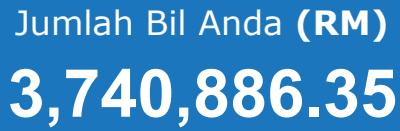
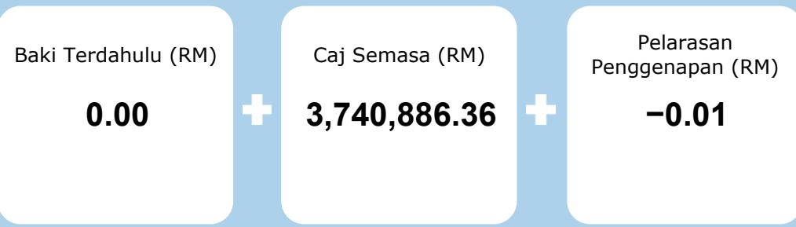
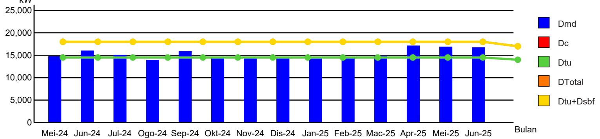

# ALAMAT POS

GS PAPERBOARD & PACKAGING SDN. BHD.

PT 43817, MUKIM TANJUNG DUA BELAS   
MUKIM DAERAH KUALA LANGAT   
42700 BANTING   
SELANGOR

# TARIKH BIL

03.07.2025

NO. AKAUN 210222505407

TEMPOH BIL   
01.06.2025 - 30.06.2025   
(30 Hari)

JENIS BACAAN Bacaan Sebenar

NO. INVOIS

DEPOSIT SEKURITI RM9,075,000.00

000109221656

# TARIF

E2:Co-Gen Baru

BAYARAN BAGI TEMPOH 01.06.2025 - 30.06.2025 RM4,172,080.45

# Biller Code: 5454 Ref-1: 210222505407

JomPAY online di Perbankan Internet dan Telefon Mudah Alih dengan akaun semasa, simpanan atau kad kredit

# KLIK DI SINI UNTUK PEMBAYARAN

Sila bayar sebelum

02 Ogos 2025

# Ringkasan Bil Anda:

  
Untuk maklumat terperinci, sila rujuk di muka surat sebelah

  
Rekod Penggunaan (Dmetered) Berbanding dengan (DTotal) Untuk Tempoh13 Bulan Bil Elektrik Anda

# Maklumat berkaitan Caj COGEN

Metered Maximum Demand (Dmd) 16,720.00kW Total Declared Demand (Dtotal) 17,000.00kW Declared Top Up Demand (Dtu) 14,000.00kW Declared Standby Demand (Dsb) 3,000.00kW Peak Energy Consumed 3,983,440.00kWh Offpeak Energy Consumed 2,703,940.00kWh Dmd <= Dtotal

# Maklumat Tambahan Untuk Anda

Beban Diisytiharkan 17,000.00kW Kehendak Maksima Tertinggi 22,720.00kW Faktor Beban 0.56 Angkadar Kuasa 0.92

# NO. AKAUN

210222505407

# ALAMAT PREMIS

PT 43817, MUKIM TANJUNG DUA BELAS   
MUKIM DAERAH KUALA LANGAT   
42700 BANTING   
SELANGOR

MAKLUMAT BAYARAN AKHIR Amaun : RM5,000.00 Tarikh : 23.06.2025

# Anda Guna

# LPC

# KLIK DISINI

untuk

mendapatkan penyata terperinci akaun anda

<table><tr><td rowspan=1 colspan=1> Penerangan</td><td rowspan=1 colspan=1> Penggunaan</td><td rowspan=1 colspan=1> Kadar (RM)</td><td rowspan=1 colspan=1>Amaun (RM)</td></tr><tr><td rowspan=1 colspan=1>Puncak (kWh)</td><td rowspan=1 colspan=1>3,983,440.00</td><td rowspan=1 colspan=1>0.3550</td><td rowspan=1 colspan=1>1,414,121.20</td></tr><tr><td rowspan=1 colspan=1> Luar Puncak (kWh)</td><td rowspan=1 colspan=1>2,703,940.00</td><td rowspan=1 colspan=1>0.2190</td><td rowspan=1 colspan=1>592,162.86</td></tr><tr><td rowspan=1 colspan=1>Maximum Demand (kw)</td><td rowspan=1 colspan=1>16,720.00</td><td rowspan=1 colspan=1>37.0000</td><td rowspan=1 colspan=1>618,640.00</td></tr><tr><td rowspan=1 colspan=1>Standby Demand (kw)</td><td rowspan=1 colspan=1>280.00</td><td rowspan=1 colspan=1>14.0000</td><td rowspan=1 colspan=1>3,920.00</td></tr><tr><td rowspan=1 colspan=1>Jumlah</td><td rowspan=1 colspan=1></td><td rowspan=1 colspan=1></td><td rowspan=1 colspan=1>2,628,844.06</td></tr></table>

<table><tr><td rowspan=1 colspan=1> Keterangan</td><td rowspan=1 colspan=1> Tanpa ST</td><td rowspan=1 colspan=1> Dengan ST</td><td rowspan=1 colspan=1> Jumlah</td></tr><tr><td rowspan=1 colspan=1>Jumlah Penggunaan Anda (6,687,380 kWh)     RM</td><td rowspan=1 colspan=1>2,006,284.06</td><td rowspan=1 colspan=1>0.00</td><td rowspan=1 colspan=1>2,006,284.06</td></tr><tr><td rowspan=1 colspan=1>Kehendak Maksima                             RM</td><td rowspan=1 colspan=1>622,560.00</td><td rowspan=1 colspan=1>0.00</td><td rowspan=1 colspan=1>622,560.00</td></tr><tr><td rowspan=1 colspan=1>ICPT (RM0.16/kWh)                            RM</td><td rowspan=1 colspan=1>1,069,980.80</td><td rowspan=1 colspan=1>0.00</td><td rowspan=1 colspan=1>1,069,980.80</td></tr><tr><td rowspan=1 colspan=1>Caj Penggunaan Bulan Semasa                 RM</td><td rowspan=2 colspan=1>3,698,824.86</td><td rowspan=2 colspan=1>0.00</td><td rowspan=2 colspan=1>3,698,824.8642,061.50</td></tr><tr><td rowspan=1 colspan=1>Kumpulan Wang Tenaga Boleh Baharu (1.6%)RM</td></tr><tr><td rowspan=1 colspan=1>Caj Semasa                              RM</td><td rowspan=1 colspan=3>3,740,886.36</td></tr></table>

# Maklumat Meter

<table><tr><td rowspan="2"> No. Meter</td><td colspan="2"> Bacaan Meter</td><td rowspan="2"> Penggunaan</td><td rowspan="2"> Unit</td></tr><tr><td> Dahulu</td><td> Semasa</td></tr><tr><td>M 821800109</td><td>0</td><td>3,983,440</td><td>3,983,440</td><td>kWh P</td></tr><tr><td>M 821800109</td><td>0</td><td>2,703,940</td><td>2,703,940</td><td> kWh O</td></tr><tr><td>M 821800109</td><td>0</td><td>16,720</td><td>16,720</td><td>kW P</td></tr><tr><td>M 821800109</td><td>0</td><td>14,680</td><td>14,680</td><td>kw 0</td></tr><tr><td>M 821800109</td><td>0</td><td>2,796,800</td><td>2,796,800</td><td>kVARh</td></tr></table>

# Saluran Pembayaran

myTNB

PERBANKAN INTERNET

EPAY(Petronas, KK Mart, Caltex)

KIOS @ KEDAI TENAGA

e-WALLET(Boost, Touch ‘n Go eWallet)

# Perlu Bantuan?

1-300-88-5454 Pertanyaan akaun dan bil

15454

Gangguan bekalan elektrik di rumah dan lampu jalan

tnbcareline@tnb.com.my

TNB CareLine

Tenaga_Nasional

Untuk maklumat lanjut, sila layari www.mytnb.com.my

# Kedai Tenaga Terdekat :

TNB BANTING   
LOT 4, JLN BUNGA PEKAN   
42700 BANTING   
SELANGOR   
Tel : 03-31872020

Surcaj 16 sen/kWh bagi jumlah penggunaan bulanan dari 1 Jul 2024 - 30 Jun 2025.

Bayaran melalui cek sah setelah penjelasan cek oleh bank

ICPT - Pelepasan Imbangan Kos Penjanaan