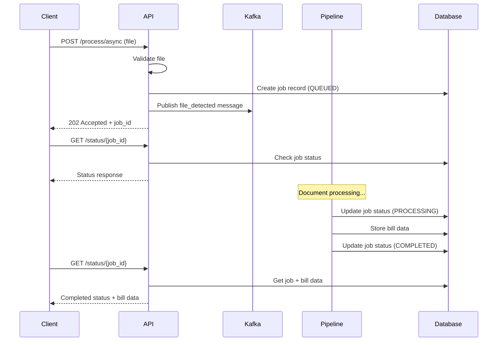

# Document Processing API Documentation

> **Malaysian utility bill processing API with Kafka integration**

## 🚀 Overview

The Document Processing API provides RESTful endpoints for uploading and processing Malaysian utility bills. It integrates with a Kafka-based document processing pipeline to handle asynchronous document processing with real-time status tracking.

**Base URL**: `/api/v1`  
**Version**: `1.0.0`  
**Framework**: FastAPI with async support

## 📋 API Endpoints

### Document Processing

#### `POST /api/v1/document_processing/process/async`

Process a document asynchronously and return immediately with a job ID.

**Request:**
- **Method**: `POST`
- **Content-Type**: `multipart/form-data`
- **Body**: File upload (PDF, PNG, JPG, JPEG)
- **Max File Size**: 50MB

**Response:**
- **Status Code**: `202 Accepted`
- **Headers**: 
  - `Retry-After: 5` (polling interval in seconds)
- **Body**: `AsyncProcessResponse`

```json
{
  "job_id": "uuid-string",
  "status": "queued",
  "message": "Document queued for processing. Poll GET /api/v1/status/{job_id} every 5 seconds."
}
```

**Error Responses:**
- `400 Bad Request`: Invalid file type or size
- `500 Internal Server Error`: Failed to queue job

**Example Usage:**
```bash
curl -X POST "http://localhost:8000/api/v1/document_processing/process/async" \
  -H "Content-Type: multipart/form-data" \
  -F "file=@invoice.pdf"
```

#### `GET /api/v1/document_processing/status/{job_id}`

Check the processing status and retrieve results for a job.

**Request:**
- **Method**: `GET`
- **Path Parameters**:
  - `job_id` (string): Job identifier from async processing request

**Response:**
- **Status Code**: `200 OK`
- **Body**: `StatusResponse`

```json
{
  "job_id": "uuid-string",
  "status": "completed",
  "document_name": "invoice.pdf",
  "bill_data": {
    "id": "bill-uuid",
    "document_name": "invoice.pdf",
    "issue_date": "2025-01-15T00:00:00",
    "due_date": "2025-02-15T00:00:00",
    "amount_due": 150.75,
    "status": "COMPLETED",
    "extracted_jsonb": {
      "vendor_name": "Tenaga Nasional Berhad",
      "account_number": "1234567890",
      "invoice_number": "INV-2025-001"
    },
    "created_at": "2025-01-15T10:30:00",
    "updated_at": "2025-01-15T10:32:00",
    "version": 1
  },
  "error": null,
  "created_at": "2025-01-15T10:30:00",
  "completed_at": "2025-01-15T10:32:00"
}
```

**Job Status Values:**
- `queued`: Job created and waiting for processing
- `processing`: Document is being processed
- `completed`: Processing finished successfully
- `failed`: Processing failed with error

**Error Responses:**
- `404 Not Found`: Job not found

**Example Usage:**
```bash
curl "http://localhost:8000/api/v1/document_processing/status/your-job-id"
```

### Health & Monitoring

#### `GET /api/v1/health`

Comprehensive health check for the document processing microservice.

**Request:**
- **Method**: `GET`

**Response:**
- **Status Code**: `200 OK` (healthy) or `503 Service Unavailable` (degraded)
- **Body**: `HealthResponse`

```json
{
  "status": "healthy",
  "timestamp": "2025-01-15T10:30:00",
  "services": {
    "kafka": "connected",
    "database": "connected",
    "file_system": "accessible"
  },
  "version": "1.0.0"
}
```

**Service Status Values:**
- `connected`: Service is available and responding
- `disconnected`: Service is unavailable
- `accessible`: File system is writable
- `inaccessible`: File system is not writable

**Overall Status:**
- `healthy`: All services are operational
- `degraded`: Some services are unavailable

#### `GET /api/v1/health/ready`

Readiness check to determine if the API is ready to serve requests.

**Request:**
- **Method**: `GET`

**Response:**
- **Status Code**: `200 OK` (ready) or `503 Service Unavailable` (not ready)

```json
{
  "status": "ready",
  "message": "API is ready to serve requests"
}
```

#### `GET /api/v1/health/live`

Liveness check to determine if the API process is alive.

**Request:**
- **Method**: `GET`

**Response:**
- **Status Code**: `200 OK`

```json
{
  "status": "alive",
  "timestamp": "2025-01-15T10:30:00"
}
```

## 📊 Data Models

### AsyncProcessResponse

Response model for async document processing.

```json
{
  "job_id": "string",
  "status": "string",
  "message": "string"
}
```

**Fields:**
- `job_id` (string): Unique job identifier
- `status` (string): Initial status (always "queued")
- `message` (string): Status message with polling instructions

### StatusResponse

Response model for job status check.

```json
{
  "job_id": "string",
  "status": "string",
  "document_name": "string",
  "bill_data": {},
  "error": "string",
  "created_at": "datetime",
  "completed_at": "datetime"
}
```

**Fields:**
- `job_id` (string): Job identifier
- `status` (string): Current status (queued, processing, completed, failed)
- `document_name` (string, optional): Original document filename
- `bill_data` (object, optional): Extracted bill data if completed
- `error` (string, optional): Error message if failed
- `created_at` (datetime): Job creation timestamp
- `completed_at` (datetime, optional): Job completion timestamp

### HealthResponse

Response model for health check.

```json
{
  "status": "string",
  "timestamp": "datetime",
  "services": {},
  "version": "string"
}
```

**Fields:**
- `status` (string): Overall service status (healthy, degraded, unhealthy)
- `timestamp` (datetime): Health check timestamp
- `services` (object): Status of dependent services
- `version` (string): API version

## 🔄 Processing Flow

### Async Processing Workflow



### Processing Steps

1. **File Upload**: Client uploads document via `/process/async`
2. **Validation**: API validates file type and size
3. **Job Creation**: Job record created in database with `QUEUED` status
4. **Kafka Publishing**: File detection message published to Kafka
5. **Immediate Response**: API returns job ID with `202 Accepted`
6. **Processing**: Document processing pipeline handles the file
7. **Status Updates**: Pipeline updates job status via Kafka
8. **Polling**: Client polls `/status/{job_id}` every 5 seconds
9. **Completion**: Client receives final results when processing completes

## ⚙️ Configuration

### File Upload Limits

- **Max File Size**: 50MB
- **Allowed Extensions**: `.pdf`, `.png`, `.jpg`, `.jpeg`
- **Upload Directory**: `./data/temp/uploads`

### Processing Timeouts

- **Processing Timeout**: 120 seconds
- **Polling Interval**: 5 seconds (recommended)
- **Max Polling Duration**: Until completion or timeout

### Dependencies

- **Kafka**: Message broker for async processing
- **PostgreSQL**: Database for job tracking and bill storage
- **File System**: Temporary file storage

## 🚨 Error Handling

### Common Error Scenarios

1. **File Validation Errors**
   - Unsupported file type
   - File too large (>50MB)
   - Corrupted file

2. **Processing Errors**
   - PDF corruption (handled by repair pipeline)
   - Extraction failures
   - Database connection issues

3. **Job Management Errors**
   - Job not found
   - Timeout exceeded
   - Kafka publishing failures

### Error Response Format

```json
{
  "detail": "Error message description"
}
```

## 🔧 Development & Testing

### Running the API

```bash
# Start the API server
python -m uvicorn src.backend.api.main:app --reload --host 0.0.0.0 --port 8000

# Access API documentation
# Swagger UI: http://localhost:8000/docs
# ReDoc: http://localhost:8000/redoc
```

### Testing Endpoints

```bash
# Health check
curl http://localhost:8000/api/v1/health

# Process document
curl -X POST "http://localhost:8000/api/v1/document_processing/process/async" \
  -H "Content-Type: multipart/form-data" \
  -F "file=@test_invoice.pdf"

# Check status
curl http://localhost:8000/api/v1/document_processing/status/{job_id}
```

## 📈 Performance Considerations

- **Async Processing**: Non-blocking file uploads with immediate response
- **Horizontal Scaling**: Kafka-based architecture supports multiple consumers
- **Polling Optimization**: 5-second polling interval balances responsiveness and load
- **File Cleanup**: Temporary files are managed automatically
- **Database Optimization**: Indexed job tracking and bill storage

## 🔒 Security Considerations

- **File Validation**: Strict file type and size validation
- **Path Security**: Secure file upload handling
- **Input Sanitization**: Proper handling of file names and paths
- **Error Information**: Limited error details to prevent information leakage

---

**Ready to process Malaysian utility bills?** 🚀

Start with the [Health Check](#get-apiv1health) to verify service status, then use [Async Processing](#post-apiv1document_processingprocessasync) to upload and process your documents.
