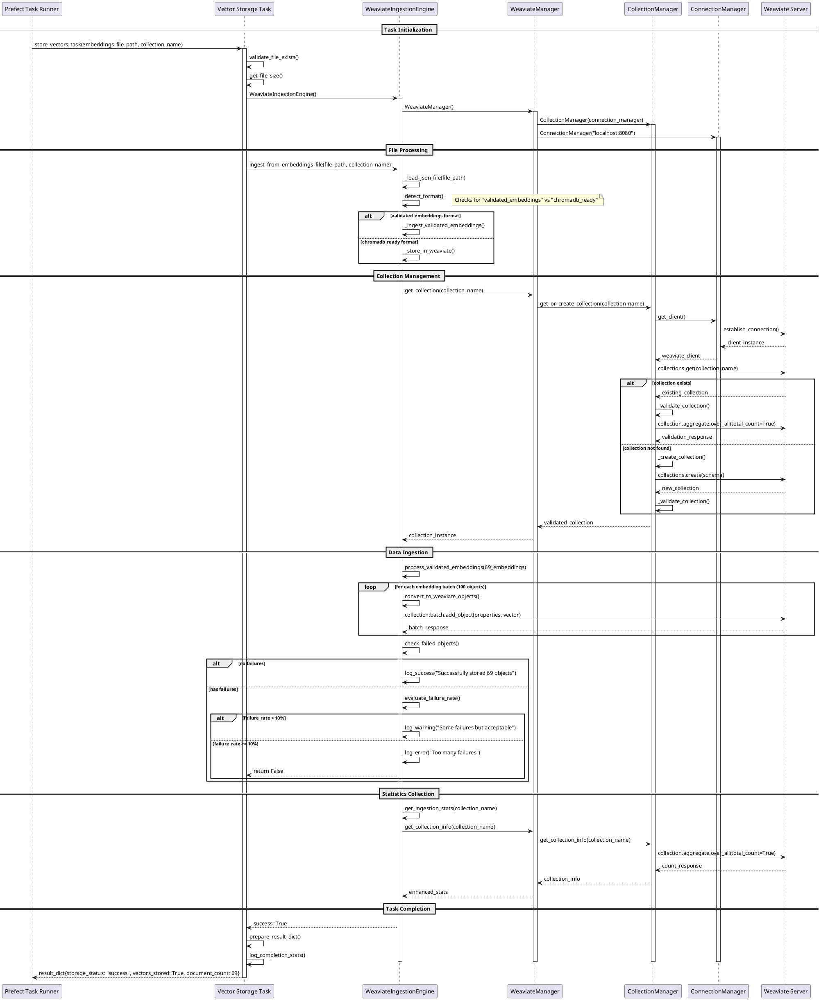

# Vector Storage Task - Sequence Diagram

## Overview
The vector storage task handles the ingestion of embeddings from JSON files into Weaviate vector database. This diagram shows the complete flow from task initiation to successful storage.

## Sequence Diagram

## Key Flow Points

### 1. **File Validation & Loading**
- Task validates embeddings file exists and gets size
- Engine loads and parses JSON content
- Format detection determines processing path

### 2. **Collection Management** 
- Manager delegates to CollectionManager for collection operations
- ConnectionManager handles Weaviate client lifecycle
- Collections are created with BYOV (Bring Your Own Vectors) configuration
- Validation ensures collection is accessible before proceeding

### 3. **Data Processing Pipeline**
- `validated_embeddings` format: Direct property mapping
- `chromadb_ready` format: Format conversion then ingestion
- Batch processing with configurable batch size (100 objects)
- Error tolerance: Up to 10% failures acceptable

### 4. **Critical Error Handling**
- Collection validation failures trigger recreation
- UUID format issues resolved by auto-generation
- Batch failures monitored with early termination on excessive errors
- Connection errors bubble up with proper cleanup

### 5. **Statistics & Completion**
- Real-time document counting via Weaviate aggregation
- Comprehensive result dictionary with timing metrics
- Success/failure status with detailed error information

## Performance Characteristics

- **Processing Time**: ~2.6 seconds for 69 embeddings (4.4MB file)
- **Batch Size**: 100 objects per batch for optimal throughput
- **Memory Usage**: Streaming JSON processing, minimal memory footprint
- **Error Tolerance**: Up to 10% failure rate before task fails
- **Connection Pooling**: Single connection per ingestion session

## Error Recovery Patterns

1. **Collection Not Found** → Auto-create with proper schema
2. **Collection Validation Failed** → Recreate and validate
3. **Invalid UUID Format** → Let Weaviate auto-generate UUIDs
4. **Batch Import Errors** → Continue if failure rate < 10%
5. **Connection Issues** → Proper cleanup and error propagation